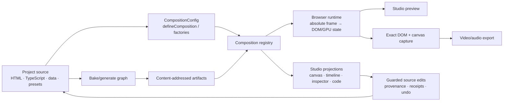

# FrameDiff architecture

> **Status:** canonical description of the implemented architecture. Product intent belongs in
> [PRD.md](./PRD.md); exact HTML attributes belong in
> [HTML-COMPOSITIONS.md](./HTML-COMPOSITIONS.md); older graph and GUI documents are retained as
> design history and deeper rationale.

FrameDiff is a code-first video system. A project owns composition documents, project data, and
project-specific presets. The `framediff` package owns the reusable composition runtime, effects,
rendering, asset/build machinery, and integrations. Preview and export mount the same composition
and advance the same absolute frame clock.

The most important dependency rule is:

> **Examples depend on FrameDiff. FrameDiff never depends on examples.** When an example invents a
> generally useful renderer, effect adapter, composition factory, or deterministic helper, promote
> it into `packages/framediff` and make the example consume the packaged API.

## System shape



The runtime is framework-free. A composition is ordinary HTML/CSS/JavaScript plus a small
`data-fd-*` ABI. An optional TypeScript `setup` attaches reusable logic such as WebGPU grading,
three.js, or GSAP. `defineComposition()` parses the document into a `CompositionConfig`; a registry
makes root and nested compositions addressable by stable keys.

## Vocabulary and boundaries

| Concept | Meaning | Typical home |
| --- | --- | --- |
| **Effect implementation** | Reusable rendering behavior such as grade, LUT, corner pin, or 3D video plane. | `packages/framediff/src/effects/` |
| **Composition factory** | Reusable code that creates a complete composition boundary for a common pattern. | `packages/framediff/src/compositions/` or an integration entry point |
| **Project preset** | Brand/look/camera defaults configuring packaged effects. | `examples/*/src/effects/` or an application project |
| **Effect instance** | One application of an effect, with concrete parameters and optional timing. | Inside a project composition |
| **Composition** | A timed container with its own dimensions, fps, duration, timeline, and output. | `examples/*/src/compositions/` |
| **Nested composition** | A composition placed as a clip in another composition. | The owning composition's timeline |
| **Asset** | Source media referenced by URL or portable `asset://` identity. | Manifest + project source |
| **Artifact** | Derived, content-addressed output such as a bake or generated take. | CAS + manifest/lock data |

An effect is not automatically a composition. A grade, vignette, LUT, or corner pin normally stays
on a clip, track, or output layer. Add a composition boundary when the result is a self-contained
shot with its own time domain, contains multiple coordinated elements/effects, is reused, or benefits
from independent navigation, baking, and caching.

The 3D plane shots demonstrate the distinction:

- `createVideoPlane3DSetup()` is the reusable effect adapter.
- `defineVideoPlane3DComposition()` is the reusable shot factory.
- `HeroPlane3D.uizoom` and `HeroPlane3D.june3d` are project-owned composition instances containing
  specific footage, camera keys, focus, motion blur, grade, and LUT choices.

Likewise, `defineThreeScene()` describes a reusable deterministic world and named cameras, while
`defineThreeSceneComposition()` adds dimensions, duration, and camera cuts to make that world a
nestable timeline composition.

## Frame phase and bake phase

FrameDiff keeps two kinds of work separate.

### Frame phase

The frame phase must derive visible/audio state from the requested absolute frame. It includes DOM
layout, media selection, animation, color/LUT passes, corner pins, lightweight 3D planes, and three.js
previz. Scrubbing directly to frame 150 must produce the same result as playing through frames 0–149.

GPU/WebGL effects attach to ordinary canvases and register an exact capture callback. Preview paints
the live canvas; export asks the same renderer for the requested source time and composites the
readable result. This is the operational meaning of **preview = render**.

### Bake phase

Async, expensive, external, or resumable work belongs in the bake/generate graph: precomposition
bakes, transcoding, remote generation, and potentially heavy 3D renders. Inputs are fingerprinted;
outputs land in a content-addressed store and return to the frame phase as ordinary media. Paid
generation is always explicit and pinned—rendering a frame never silently submits an external job.

The deciding rule is simple: if an operation is a deterministic and acceptably cheap function of one
frame, keep it live; if it is async, expensive, external, or must survive retries, bake it.

## Source of truth and Studio

Project code is authoritative. The Studio derives canvas, timeline, Inspector, animation, artifact,
and agent views from the running composition and its declared source metadata. Stable `data-fd-id`
values join those views.

Editable literal values retain source provenance. A Studio gesture uses guarded source revisions and
produces a reversible receipt; computed or opaque values remain renderable but read-only until the
user explicitly materializes or unrolls them. Nested content remains owned by the child composition
until the user opens that composition. The exact mutation and history rules are in
[STUDIO-EDITING-CONTRACTS.md](./STUDIO-EDITING-CONTRACTS.md).

The current implementation does not require every frame-phase effect to exist as a separately
serialized graph node. Effects are authored through HTML attributes and setup modules, then projected
into Studio metadata where supported. The longer-term node/timeline IR remains useful design context,
but it must not be mistaken for a second source of truth.

## Package ownership

`packages/framediff/src/` is organized by reusable responsibility:

```text
composition.ts          composition contract and setup composition
compositions/           reusable composition factories
effects/                grade, LUT, homography, camera and 3D-plane implementations
three/                  optional deterministic three.js scenes and scene compositions
gsap/                   optional frame-authored GSAP integration
render/                 exact frame capture, audio mix, encode and export
assets/ + graph/ + nodes/ assets, fingerprints, CAS, planning and bake nodes
studio/ + studio-runtime/ source projection and project runtime bridge
determinism.ts          reusable repeated-frame pixel checker
```

Project repositories should use this shape:

```text
src/
├── compositions/       HTML documents, composition wrappers/factories, nested edits
│   └── labs/           optional acceptance/demo compositions
├── effects/            project presets and effect orchestration using packaged effects
├── data/               EDLs, imported/generated camera data, copy, constants, asset mappings
├── gen/                explicit generative recipes
└── config.ts           composition registry only
```

`config.ts` should orchestrate imports, not implement effects or construct large compositions.
Generated user compositions may initially land outside this layout, but curated examples should be
organized before they become reference material.

## The example-to-package promotion rule

Examples are product proofs and API consumers, not a second utility library. During example work:

1. Prototype the smallest uncertain piece in the example if necessary.
2. Ask whether the code is independent of the example's brand, assets, source reconstruction, and
   story. A likely second consumer is enough; an existing duplicate makes promotion mandatory.
3. Move the reusable contract and implementation into `packages/framediff` in the same change.
4. Give the package API types, focused tests, a public export, and preview/export-safe lifecycle.
5. Replace the example implementation with an import from `framediff`.
6. Leave only project presets, source data, editorial decisions, and content in the example.

Promote these:

- renderers, shaders, media adapters, camera evaluators, transitions, and effect lifecycle helpers;
- generic composition factories and integration adapters;
- deterministic render/test helpers;
- parsing, normalization, source mapping, or caching logic not tied to one project's content.

Keep these in the project:

- brand-specific color values, fitted LUT selection, copy, EDLs, and asset IDs;
- one-off AE reconstruction data or hand-fitted camera curves;
- the actual scene, edit, prompt, story, and composition registry.

Do not copy a package candidate into multiple examples “for clarity.” Package it and make each
example demonstrate configuration. Conversely, do not put a finished branded composition into the
core package; extract the factory or primitive that makes it possible.

## Current reusable catalog

The main packaged surfaces used by the examples are:

- `combineCompositionSetups()` — compose effect/integration setup modules with ordered cleanup.
- `escapeHtml()`, `htmlAttributes()`, and `kebabCase()` — safe generated-composition markup helpers.
- `createGradeVideoSetup()` — attach the WebGPU grade/LUT/bloom/vignette pipeline.
- `createNamedVideoLookSetup()` and `gradeDataAttributes()` — keep project-owned look maps thin
  while the package owns look application and HTML ABI serialization.
- `createClipMotionSetup()`, `createWipeRevealSetup()`, `createCharacterRiseSetup()`, and
  `createAudioFadeOutSetup()` — reusable deterministic DOM/timeline effect behavior.
- `createVideoPlane3DSetup()` — attach a video-textured plane, virtual camera, DoF, and motion blur.
- `cameraKeyframesFromProgress()` — expand fitted project progress curves into ordinary camera keys.
- `defineVideoPlane3DComposition()` — create a self-contained/nestable 3D plane shot.
- `defineThreeScene()` and `createThreeSceneSetup()` — deterministic three.js world and runtime.
- `defineThreeSceneComposition()` — create a nestable scene with named camera cuts.
- `generative()` — declare an explicit, pinned generation recipe as a composition.
- `checkCompositionDeterminism()` — repeatedly render selected frames and compare pre-encode pixels.

## Documentation map

- [HTML-COMPOSITIONS.md](./HTML-COMPOSITIONS.md) — implemented authoring ABI and frame lifecycle.
- [STUDIO-EDITING-CONTRACTS.md](./STUDIO-EDITING-CONTRACTS.md) — identity, provenance, edits, history.
- [AGENT-API.md](./AGENT-API.md) — machine-readable Studio inspection and editing.
- Hosted control-plane and deployment documentation lives in the separate private
  `framediff-hosted` repository.
- [SVELTEKIT-STUDIO-ARCHITECTURE.md](./SVELTEKIT-STUDIO-ARCHITECTURE.md) — implemented Studio package
  boundaries and dependency direction.
- [COMPOSITION-GRAPH.md](./COMPOSITION-GRAPH.md) — deep bake/CAS/generation design rationale; some
  sketches are prospective.
- [NODE-TIMELINE-GUI.md](./NODE-TIMELINE-GUI.md) — prospective explicit node/timeline IR design.
- [WORKFLOWS-AS-VIEWS.md](./WORKFLOWS-AS-VIEWS.md) — user-space workflow projection rationale.
- [PRD.md](./PRD.md) — product goals and roadmap, not the current code-level contract.

See [README.md](./README.md) for the complete current/reference/historical documentation index.
