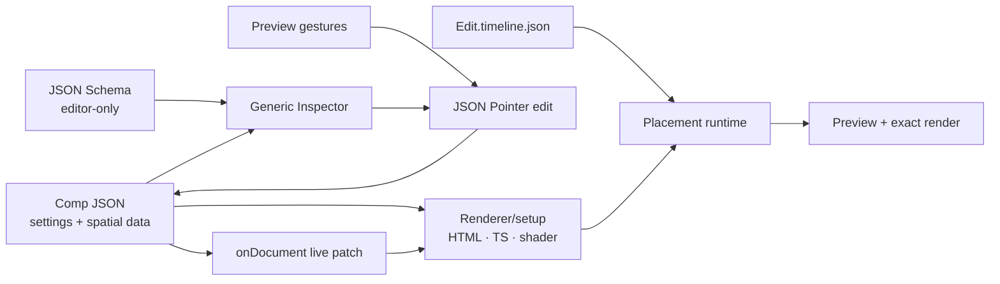

# Composition-owned authoring and data

Status: implemented foundation. This contract covers direct preview editing, JSON-backed settings,
optional timelines, complex effect workspaces, and cache propagation without moving application
chrome into compositions.

## Ownership

FrameDiff has three distinct owners:

1. The SvelteKit application owns global navigation, composition rail, media, code, Git, render,
   transport implementation, panel layout, and window management.
2. A composition owns its render HTML/CSS/TypeScript, its JSON data model, stable selectable object
   IDs, and any preview-local interaction such as spline, camera, pin, cloth, or procedural tools.
3. Reusable effects own their parameter schema and may request a larger editor workspace in addition
   to ordinary Inspector controls.

The JSON document is persistent render data. Viewport orbit, hover, open panels, selection, and modal
state remain ephemeral Studio state.

`kind` describes what a composition is; Studio derives its normal authoring surfaces from that
semantic rather than treating every time-varying render as an edit:

| Kind | Primary authoring surface | Timeline default | Transport | Accepts comp drops |
| --- | --- | --- | --- | --- |
| `edit` | layered assembly | always, including an empty drop target | yes | yes, as timed nested clips |
| `scene` | directly editable visual canvas | only for real temporal rows or registered motion | yes | no |
| `3d` | spatial/procedural canvas and custom tools | only for cameras or other temporal rows | yes | no |
| `generate` | recipe inputs, parameters, and takes | no | no | inputs use `comp://`, not timeline nesting |
| `audio` | audio arrangement | always | yes | no |
| `plan` | timed beats/shot plan | always | yes | no |
| `script`, `storyboard` | timed narrative document/boards | only when rows carry timing | with that timeline | no |
| `doc`, `locations`, `cast` | structured reference document | no | no | no |
| `board`, `moodboard` | directly editable planning canvas | no | no | no |

A full-duration DOM wrapper is usually structural content, not a clip. Static scene examples do not
add `data-fd-clip` simply to make their children selectable; stable `data-fd-id` values and JSON
bindings provide that independently. A procedural comp may still expose a full-duration simulation
item for comp-level settings while explicitly hiding the standard timeline in favor of its custom tool.



## Composition declaration

Simple properties use JSON Schema; complex geometry is edited by composition code and commits to the
same JSON Pointer model.

```ts
import clothDocument from "./KineticCloth.comp.json";

export const cloth = defineComposition(clothHtml, {
  document: clothDocument,
  meta: {
    document: {
      file: "src/KineticCloth.comp.json",
      schema: "src/KineticCloth.schema.json",
      bindings: {
        cloth: "/params",
        "cloth-sheet": "/material"
      }
    },
    authoring: { timeline: "hidden", transport: "always", directManipulation: true }
  },
  setup({ document, onDocument }) {
    const apply = (next: unknown) => updateClothSolver(next);
    apply(document);
    return onDocument(apply);
  }
});
```

The generic Inspector currently projects JSON Schema strings, multiline strings, numbers/sliders,
colors, enums, asset references, and booleans. Arrays and compound geometry intentionally remain in
custom preview tools so a spline does not degrade into dozens of raw number inputs.

Every bound canvas object remains clickable. Selection opens its properties; movable/resizable
JSON properties (`x`, `y`, `width`, `height`, text, typography, fills, layout, and related styles)
are projected into the shared preview/exact-render runtime. They edit directly in the preview and
commit to the bound JSON object. There is no “make movable” step. An unbound stable HTML element can
also be moved or resized on its first gesture; that commit establishes explicit `data-fd-*` geometry
in its HTML source. Motion paths, camera handles, and other registered tools use the same immediate
interaction rule. `directManipulation: false` disables write gestures without disabling selection.

## Edit compositions and timeline data

An edit comp keeps layer structure and rendering UI in its HTML/TypeScript, while placement values
can live in a separate versioned document:

```json
{
  "version": 1,
  "items": [
    { "id": "hero", "from": 0, "durationInFrames": 120, "layer": 0, "trimStart": 0 },
    { "id": "title", "from": 24, "durationInFrames": 72, "layer": 2 }
  ]
}
```

```ts
import timeline from "./LaunchEdit.timeline.json";

defineComposition(editHtml, {
  timeline,
  meta: {
    timelineFile: "src/LaunchEdit.timeline.json",
    authoring: { timeline: "always" }
  }
});
```

The matching HTML elements still carry stable `data-fd-id` and their source/effect content, but
`from`, duration, layer, trim, and playback rate are materialized from the timeline document for both
preview and render. Timeline gestures rewrite JSON atomically. `timeline: "auto"` (the default)
applies the kind matrix above: edits/audio/plans retain their primary timeline, scenes and 3D comps
only show meaningful temporal projections, and document/board/generate kinds remain timeline-free.
`hidden` and `always` are explicit overrides. `transport` is independent: procedural code can remain
scrubbable without inventing a timeline row, while a static scene can declare `transport: "hidden"`.
Whenever transport is present without the full timeline, Studio renders a compact frame scrubber
beside play/step controls. A procedural scene therefore remains directly seekable without looking
like an edit composition or inventing fake clips.

### Planned v2: one visual layer authority

The next edit-document contract extends each item with explicit `content` and `layout` while keeping
`items[].layer` as the sole writable authority for visual compositing order. Timeline row order and DOM
paint order become projections of that value rather than separately persisted state:

```json
{
  "version": 2,
  "items": [
    {
      "id": "hero",
      "from": 0,
      "durationInFrames": 120,
      "layer": 2,
      "content": { "type": "nested", "composition": "LaunchHero" },
      "layout": {
        "rect": [120, 48, 960, 540],
        "fit": "cover",
        "focalPoint": [0.5, 0.5],
        "cornerRadius": 24,
        "opacity": 1
      }
    }
  ]
}
```

The proposed invariants are:

- Visual sibling layers are unique positive integers normalized to `1…N`; the highest value is front.
- Timeline rows sort by `layer` descending. Row numbers and track indices are never authored.
- Preview and export paint from the same item ordering. A DOM `z-index` may be assigned while rendering,
  but it is derived output and never a second source value.
- Vertical timeline moves and Inspector layer edits rewrite every affected sibling layer in one atomic,
  undoable source transaction.
- Audio routing remains outside the visual stacking namespace.
- A reusable layout may suggest a default layer, but an edit binding materializes the final
  `items[].layer` value.

See the [interactive authority plan](../examples/previz-to-gen/public/edit-layout-authority-plan.html)
and the [working edit-layout prototype](../examples/previz-to-gen/public/edit-layout-lab.html).

With nothing selected, the Inspector resolves the composition root. Unbound, scene-wide JSON
settings appear as composition properties, while canvas-bound object fields stay on their clickable
elements; composition width/height remain separately identified as format controls. Selecting an
element, clip, animation, or media asset replaces that root view with the corresponding controls.

Composition rows are also native drag sources. Dropping one on an edit timeline inserts a nested
clip at the pointer's frame; dropping one in a generative composition's input area writes a
`comp://` recipe reference. Both are ordinary guarded source edits with Undo/Redo.

## Effects and expanded editors

An effect remains attached to a composition element, clip, asset-backed layer, or grade layer. Its
ordinary fields stay in the right Inspector. An Inspector section can additionally declare a
`modal` or `inline-modal` editor presentation. The shipped color-grade section now demonstrates the
pattern; the existing camera editor demonstrates inline direct manipulation plus a full 3D dialog.
Both use the same field IDs and guarded source transactions, so opening a larger UI does not create a
second state model.

## Reload and invalidation rules

Changes are classified by what they can affect:

| Change | Preview action | Bake/cache action |
| --- | --- | --- |
| JSON settings value | `onDocument` live patch; a procedural setup may rebuild only its own solver/GPU resources | invalidate the comp and dependent baked ancestors |
| Timeline JSON placement | remount only the affected composition because clip windows are structural | invalidate the edit and dependent baked ancestors |
| HTML/CSS/TS/shader/setup | HMR swaps the affected preview | invalidate the comp and dependents |
| JSON Schema/editor presentation | refresh Inspector/editor UI | no render fingerprint change |
| Ephemeral selection/orbit/modal state | UI-only update | no invalidation |

`CompositionDescriptor.sources` includes the transitive render dependency closure: the composition
source, setup module, declared deps, composition JSON, timeline JSON, nested timeline compositions,
and `comp://` generative inputs. Those paths feed the existing artifact input hashes, so changing a
descendant's data marks both its own bake and every dependent ancestor stale while unrelated comps
remain reusable. Cycles are guarded and duplicate sources are collapsed. Schema files are
intentionally excluded from render fingerprints.

Data-only updates default to `meta.document.hotUpdate: "patch"`. A composition whose runtime cannot
apply new data safely may declare `hotUpdate: "remount"`; Studio then remounts that composition tree,
not the application or unrelated previews. Registry HMR compares the full rendered composition tree,
so a descendant document change refreshes an ancestor that embeds it while an unrelated open comp is
left mounted.

## Boundary-frame behavior

Extending a visual clip beyond its source is a hold, not transparency or black. Left extensions keep
negative trim as explicit pre-roll and sample the first source frame. Right extensions clamp to the
last decodable source frame. The clamp is shared by HTML video preview, GPU effect canvases, WebCodecs
capture, and export. Audio does not repeat its last sample; overrun remains silent.

## Implementation plan and completion

- [x] Preserve SvelteKit as the top-level application owner.
- [x] Keep stable preview selection and direct manipulation as the primary editing path.
- [x] Add composition authoring capabilities for direct manipulation and timeline visibility.
- [x] Add JSON document metadata, JSON Pointer bindings, schema-generated primitive controls, and
  guarded JSON writes.
- [x] Add `document`/`onDocument` to the framework-free setup lifecycle and patch data-only HMR in
  place.
- [x] Add external versioned timeline documents for edit placements and include them in fingerprints.
- [x] Add optional expanded effect-editor metadata and a generic modal workspace.
- [x] Hold first/last visual source frames when timeline clips extend past media bounds.
- [x] Update the HTML prototype to remove the transaction log and demonstrate a timeline-free comp.
