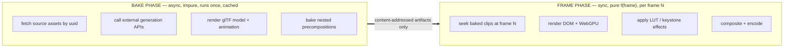
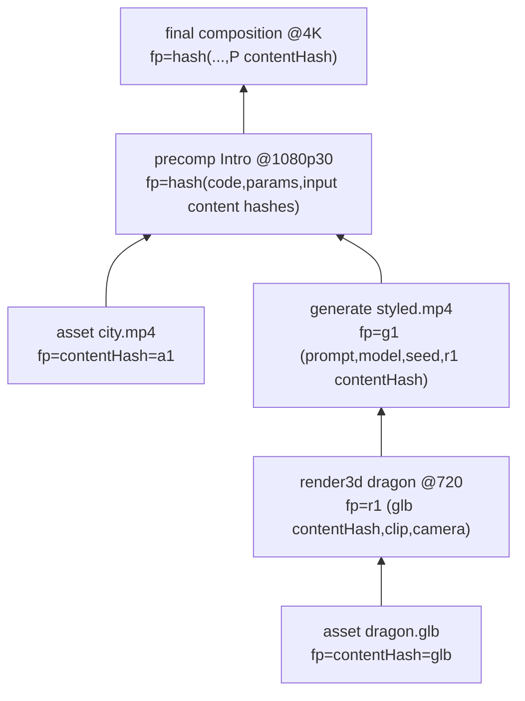
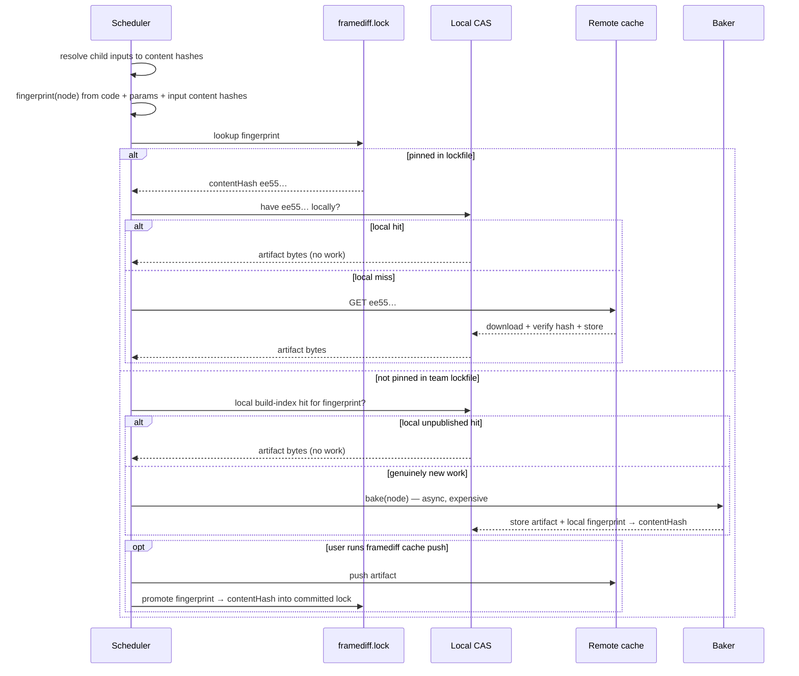
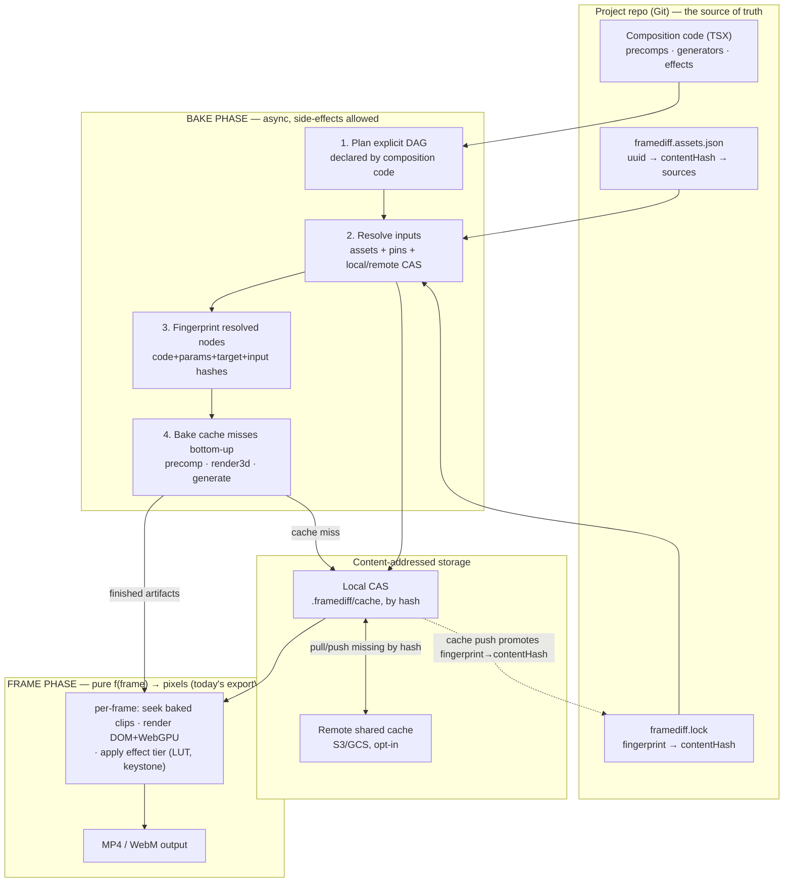
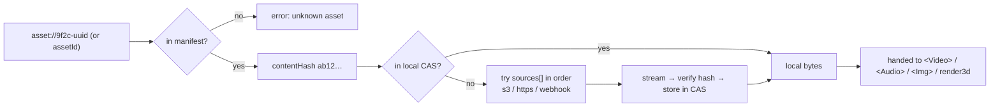
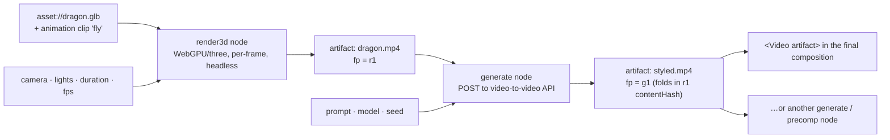

# FrameDiff — Composition Build Graph

> **Document role:** deep design rationale and prospective extensions for bakes, CAS, generators,
> and nested composition resolution. The canonical description of the implemented architecture is
> [ARCHITECTURE.md](./ARCHITECTURE.md); where old code sketches differ, the canonical architecture
> and current package APIs win.

> **Status:** Development plan v0.3 · **Date:** 2026-06-28 · **Owner:** Vikas Reddy
> **Scope:** nested compositions, content-addressed caching, asset references, a shared
> (remote) artifact cache, an async generative pipeline (external APIs / 3D), video-as-a-3D-plane
> keystoning, color LUTs, durable external jobs, audio stems, and team asset sync.
> **Relationship to the [PRD](PRD.md):** this is the post-M1 architecture for §9.4 (rendering),
> §9.5 (assets), §10.2 (nested/precomposed sequences), §10.3 (effects), and the §10.8 cloud-render
> roadmap. It does **not** change the determinism contract (§11) — it makes it scale.

---

## 0. The one idea

Everything below is one move: **split rendering into two phases divided by a content-addressed cache.**



Today FrameDiff has **only** the frame phase: `exportVideo` (in
[render/exportVideo.tsx](../packages/framediff/src/render/exportVideo.tsx)) loops `0…durationInFrames`,
re-renders the React tree per frame, and encodes. That loop is — and must stay — a **pure function of
the frame** (PRD §11: no wall-clock, no async, no unseeded randomness).

But every one of the seven asks is inherently **async, expensive, or side-effecting**: fetching a 2 GB
source, calling a paid video-to-video API, rendering a rigged 3D model, baking a sub-composition.
None of that can live inside a pure per-frame loop.

So we add a **bake phase** in front of it. The bake phase is allowed to be async and impure; it does
all the expensive work **once**, writes the results into a **content-addressed store** (CAS), and
hands the frame phase nothing but finished, hashed artifacts. The frame phase stays exactly as pure
and deterministic as it is today — it just consumes pre-baked clips and textures instead of doing the
work inline.

Caching, sharing, nesting, and generation then all fall out of one primitive: **an explicit build graph
whose resolved nodes are addressed by a hash of their entire input subtree (a Merkle DAG).**

The v0.3 contract tightens the parts that must be exact before implementation:

- The build graph is **declared by code before rendering**, not guessed from DOM frames after rendering.
- A node fingerprint includes the **actual content hashes of resolved byte inputs**; downstream
  generators never key only on an upstream recipe.
- A fingerprint also folds in the **toolchain** — the node's first-party code hash *and* the resolved
  versions of every output-affecting dependency/runtime — and **fingerprint completeness is a tested
  invariant** (§3.3, P0): nothing outside the declared inputs may change the produced bytes.
- `framediff.lock` is **resolution metadata only**. It pins `fingerprint -> contentHash`, is never itself an
  input to fingerprinting, and has an explicit **conflict policy** for non-deterministic bakes (§3.5).
- External generation has a **durable pending-job record** so crashes resume/poll instead of submitting
  the same paid job again.
- Precomps produce a **media bundle**: video artifact, optional audio stems, color metadata, and timing;
  their **bake resolution is a deterministic function of declared layout** (§5.1), never measured pixels.
- Asset sync has a full lifecycle: add locally, push source bytes to a team remote, pull by verified hash.
- **Heavy/optional tiers ship as separate packages** (3D, generators, remote cache) so the determinism-
  critical frame-phase core stays dependency-light (§6.1).

---

## 1. How the seven asks map to this

| # | The ask | Mechanism in this design |
|---|---------|--------------------------|
| 1 | Compositions embedded in compositions, baked to destination resolution | **Precomp node** + top-down target resolution flow + recursive `exportVideo` (§4, §5.1) |
| 2 | Cache upstream compositions, don't re-bake | **Merkle fingerprint** + **local CAS** memoization (§3.3, §3.4) |
| 3 | Reference sources by UUID, pull down if not local | **Asset manifest** + **resolver chain** local→remote (§3.1, §5.3) |
| 4 | Hash cached compositions, upload so others reuse them | **Content hashing** + **remote cache** + **`framediff.lock` pinning** (§3.5, §5.4) |
| 5 | Call external APIs; 3D file + animation → render → video-to-video → reuse downstream | **Generator / 3D-bake nodes** in the async bake phase, chained as a DAG (§5.5) |
| 6 | Input video as a 3D plane to keystone it | **Effect-tier corner-pin / 3D-quad** WGSL — real-time, stays in the frame phase (§5.6) |
| 7 | Color LUTs | **Effect-tier 3D-texture LUT** WGSL (+ optional bake-time color management) (§5.7) |

---

## 2. Why the current model can't do this (grounded in the code)

A quick honest accounting of what blocks each ask today:

- **`<Video src>` is a raw string** ([Video.tsx](../packages/framediff/src/Video.tsx)) pointing at a
  `/public` file. There is no indirection layer where "fetch this if it's missing" or "this is
  artifact `ee55…`" could hook in. → blocks #3, #4.
- **A composition is a flat `CompositionConfig`** ([composition.ts](../packages/framediff/src/composition.ts))
  with a single `component`. There is no notion of a composition *consuming another composition's
  rendered output*. → blocks #1.
- **The render loop is synchronous and recomputes everything every frame.** There is no memoization
  boundary and nothing is content-addressed. → blocks #1, #2, #4.
- **There is no place for async/side-effecting work.** `renderSync(n)` is `flushSync` — you cannot
  `await` an API inside it. → blocks #5.
- **Effects don't exist yet.** The WebGPU path is one hard-coded layer (the
  earlier WebGPU prototype compositions); there's no generic shader-effect tier to
  hang a LUT or a corner-pin on. → blocks #6, #7.

What we keep and build on (this design is deliberately additive, not a rewrite):

- The **`data-framediff-*` capture protocol** — `data-framediff-video` / `data-framediff-time` for video,
  `data-framediff-webgpu` + a `__framediffCapture(t)` hook for GPU canvases — is exactly the right seam.
  New effect tiers (LUT, keystone) and baked 3D layers reuse it verbatim.
- **MediaBunny frame decode** ([videoFrames.ts](../packages/framediff/src/render/videoFrames.ts))
  already gives us exact, deterministic source frames — that becomes the texture source for the
  effect tier and the input for generation.
- **The deterministic encode** ([encodeWorker.ts](../packages/framediff/src/render/encodeWorker.ts):
  zeroed MP4 timestamps, `prefer-software`) is what makes baked artifacts safely **content-addressable**.

---

## 3. Core concepts

### 3.1 Asset — a *source* input, referenced by UUID

An **asset** is raw source media you did not generate: a video, an audio file, an image, a `.glb`
model, a `.cube` LUT. It is referenced in code by a **stable UUID** and resolved through a manifest,
never by a fragile path.

```jsonc
// framediff.assets.json — committed to Git, small, human-diffable
{
  "version": 1,
  "assets": {
    "9f2c1e7a-uuid": {
      "name": "broll/city.mp4",          // human label, not used for resolution
      "contentHash": "blake3:ab12…",     // what it actually is
      "mime": "video/mp4",
      "bytes": 84217342,
      "sources": [                        // filled by `framediff assets push`; tried in order
        "cas://team-media/blake3/ab12…",
        "s3://framediff-media/blake3/ab12…",
        "https://cdn.example.com/ab12…"
      ],
      "proxy": "blake3:cd34…"             // optional low-res proxy for fast scrubbing
    }
  }
}
```

In code:

```tsx
<Video assetId="9f2c1e7a-uuid" />
// or the URL form, resolved by the same resolver:
<Video src="asset://9f2c1e7a-uuid" trimStart={12} />
```

The UUID is stable across renames and re-encodes; the `contentHash` is what gets fetched and cached.
Code stays in Git; the bytes live in the CAS / remote store and are pulled on demand (#3).

`framediff assets add` stores bytes in the local CAS and writes the manifest. `framediff assets push`
uploads those source bytes to the configured team asset remote and writes or validates `sources[]`.
`framediff assets pull` hydrates a fresh clone from `sources[]`, verifying the downloaded bytes against
`contentHash` before they are usable. This keeps "clone repo + pull assets" from depending on anyone's
machine-specific paths.

### 3.2 Artifact — a *derived* output, addressed by content

An **artifact** is anything FrameDiff *produces* that is deterministic given its inputs: a baked
precomposition media bundle, a 3D-render clip, the output of a generation API, a transcoded proxy.
Artifacts are immutable and identified by the **hash of their bytes** (`contentHash`). A bundle is a
small JSON artifact whose bytes reference video/audio/color outputs by content hash; a clip is a media
byte artifact directly. Two bakes that produce identical bytes are the same artifact and stored once.

Assets and artifacts share one storage layer (§3.4) and one resolver — the only difference is that an
asset's bytes come from `sources[]`, an artifact's bytes come from *running a recipe*.

### 3.3 Fingerprint — the cache key (a Merkle DAG)

Every build node has a **fingerprint**: a hash of the node's declared recipe plus the **actual content
hashes of its resolved inputs**. The scheduler computes fingerprints bottom-up. A parent can be
fingerprinted after its children have been resolved from the lockfile / CAS / remote cache, or baked; it
does **not** require running the parent.

This distinction matters for generators. A video-to-video API consumes bytes, not an abstract recipe.
If two GPUs produce different bytes for the same `render3d` recipe, the downstream generator must see
different input hashes unless the upstream output was pinned and reused by both machines.

```ts
interface ResolvedInput {
  role: string;              // "source" | "mask" | "audio" | "lut" | ...
  fingerprint: Hash;         // the upstream node's cache key
  contentHash: Hash;         // the exact bytes this node will read
}

interface Toolchain {
  recipeVersion: string;            // bump when the baker/effect algorithm itself changes
  codeHash: Hash;                   // canonical hash of the node's first-party source modules (§6.2)
  deps: Record<string, string>;     // resolved versions of output-affecting deps: three, html-to-image,
                                    //   mp4-muxer, mediabunny, the LUT parser… (a slice of the lockfile)
  runtime?: string;                 // GPU/encoder-touching nodes: encoder identity (e.g. "prefer-software")
}

function fingerprint(node: BuildNode, inputs: ResolvedInput[]): Hash {
  return blake3(canonicalJSON({
    kind: node.kind,                       // "precomp" | "render3d" | "generate" | "asset" | …
    toolchain: node.toolchain,             // recipeVersion + codeHash + resolved dep/runtime versions
    params: node.params,                   // resolution, fps, duration, effect props, prompt, model, seed…
    target: node.targetKey(),              // each kind declares HOW (or whether) the render target folds in
    inputs,                                // ← Merkle recursion plus exact byte binding
  }));
}
```

> **`codeHash` must be computed identically everywhere.** Preview (Vite), `framediff render` (headless), and
> the cloud worker may not share a bundler, so define *one* canonical first-party module-graph hash they all
> reproduce — otherwise the same node fingerprints differently per runner and the cache misses team-wide.
> `deps` folds in the versions a bundler change *wouldn't* catch (a three.js bump changes 3D bytes without
> touching first-party code). `targetKey()` is per-kind: a precomp always folds in its baked resolution; a
> fixed-resolution v2v generator folds in nothing — encode that intent in each node, don't guess globally.



**Four key properties:**

- **Fingerprint ≠ content hash.** The fingerprint is computed from declared inputs and resolved input
  byte hashes. The content hash is the hash of the produced bytes. We keep both. The fingerprint is the
  cache *key*; the content hash is what we store, verify, and pin.
- **The lockfile is not an input.** `framediff.lock` may answer "for this fingerprint, use content hash
  X", but changing the lockfile does not itself change fingerprints. It only changes which pinned bytes
  are resolved for already-known keys.
- **Determinism is the precondition.** A node is only safely cacheable if it is a pure function of its
  declared recipe and resolved input bytes. Generators are forced into this model by keying on
  `(provider, endpoint, providerVersion, model, modelRevision, prompt, seed, inputContentHashes)` — same
  key means we resume or reuse; we do not submit a new API job (§5.5).
- **Completeness is a tested invariant (P0).** The fingerprint must capture *every* input that can change
  the produced bytes — and nothing else. We prove it with a mutation property test: perturb any declared
  input (param, code, dep version, resolved upstream byte, target) ⇒ the fingerprint must change; and a
  bake must not read anything *outside* its declared inputs. A false cache hit (stale bytes silently
  reused) is the worst failure this system can produce, so this test gates every node kind.

### 3.4 Local CAS — the on-disk content-addressed store

A flat, hash-named store (write via the File System Access API per PRD §9.1, or `~/.framediff/cache`
for the headless CLI):

```
.framediff/
├─ cache/
│  ├─ blake3/ab/12/ab12…         # asset & artifact bytes, named by content hash
│  ├─ proxies/cd/34/cd34…        # generated low-res proxies
│  └─ index.json                 # contentHash → {kind, bytes, lastUsed} for GC
├─ build-index.json              # local-only fingerprint → contentHash memo table
└─ jobs/<fingerprint>.json       # local-only external job resume records (§3.6)
```

Resolution is "does this hash exist locally?" → yes, mmap/stream it; no, go remote (§3.5). Garbage
collection is LRU by `lastUsed`, keyed off the lockfile (anything pinned is retained).

**Hash function.** Content addresses use BLAKE3 — fast, parallel, and **streaming**, which matters when an
asset is multi-gigabyte (we hash a stream from the File System Access API, never a full in-memory buffer).
WebCrypto has no BLAKE3, so this is a small permissively-licensed userland dependency (the `blake3` WASM
binding is MIT); WebCrypto-native SHA-256 (already used by the determinism-check example) is the zero-dep
fallback at the cost of speed. The choice is fixed in P0 and folded into `recipeVersion`, so it can never
silently change an address.

### 3.5 Remote cache + `framediff.lock` — sharing bakes between people (#4)

The remote cache is the same CAS, hosted (S3/GCS/your bucket — BYO-credentials per the PRD's open-core
model). The bridge between "my machine baked it" and "your machine reuses it" is a committed lockfile:

```jsonc
// framediff.lock — committed to Git
{
  "version": 1,
  "artifacts": {
    "<fingerprint>": {
      "kind": "precomp",
      "contentHash": "blake3:ee55…",   // the exact bytes everyone should use
      "bytes": 1203998,
      "target": { "w": 1920, "h": 1080, "fps": 30 },
      "remote": "cache://framediff/ee55…",
      "createdAt": "2026-06-25",
      "note": "Intro precomp @1080p30"
    }
  }
}
```

The lockfile **pins `fingerprint → contentHash`**. When a teammate pulls the repo:



**Why pin the content hash instead of just re-baking from the key?** Two reasons, both critical:

1. **Cost / non-determinism.** A video-to-video API is paid and non-deterministic. You do **not** want
   every teammate re-calling it and getting a *different* clip. Pinning means the first person's
   result is downloaded by everyone, byte-for-byte (#4, #5).
2. **Cross-machine pixel drift.** Even pure precomps can differ slightly across GPU/driver/encoder
   (PRD §11). Pinning the content hash means the whole team renders against *identical* upstream
   bytes — reproducibility without requiring bit-identical renderers.

`framediff render` and `framediff bake` may write a **local build index** (`fingerprint -> contentHash`) so
your own repeated renders are instant. The committed `framediff.lock` changes only when you explicitly
promote artifacts with `framediff cache push` (or an explicit `--write-lock` flag). That keeps ordinary
preview/render work from creating noisy Git churn while still making team sharing deliberate.

`framediff cache push` uploads promoted artifacts + updates `framediff.lock`; the commit carries the pins.
Pulling the repo + `framediff assets pull` + `framediff cache pull` downloads exactly what's missing, by
hash, verified on arrival.

**Conflict policy for non-deterministic bakes.** Two people can bake the *same* fingerprint (a GPU 3D
render, a paid v2v call) and get *different* bytes. Lock entries are keyed by fingerprint, so independent
edits to different nodes never collide — but a genuine double-bake of one fingerprint would. The rule:
`framediff cache push` **keeps any pin already in `framediff.lock` and refuses to overwrite it** unless given
`--force`. Intentionally buying a fresh result for an existing fingerprint is `framediff render --rerun <node>`
(risk #6), which mints a new pin the team then shares. This makes "first good result wins, everyone reuses
it byte-for-byte" the default and divergence an explicit act. Stale pins (fingerprints no longer referenced
by any composition) are pruned by `framediff cache gc --prune-lock`.

### 3.6 Durable generator jobs — paid async work must be resumable

External APIs are not just slow; they are paid, stateful systems. A crash after "submit job" but before
"download result" must not silently submit another job for the same fingerprint. Before the first POST,
FrameDiff writes a local pending-job record keyed by the generator fingerprint:

```jsonc
// .framediff/jobs/<fingerprint>.json — local state, not committed
{
  "version": 1,
  "fingerprint": "blake3:g1…",
  "kind": "video-to-video",
  "provider": "seedance",
  "endpoint": "https://api.example.com/v2v",
  "requestHash": "blake3:req…",
  "idempotencyKey": "framediff:g1…",
  "providerJobId": "job_123",
  "inputContentHashes": ["blake3:r1-bytes…"],
  "status": "submitted",              // "submitted" | "running" | "succeeded" | "failed"
  "submittedAt": "2026-06-28T18:12:00Z",
  "updatedAt": "2026-06-28T18:19:00Z",
  "resultContentHash": null
}
```

The generator runner resolves in this order:

1. Lockfile pin / local CAS / remote cache hit for the fingerprint.
2. Pending-job record exists: poll/resume/download using `providerJobId`.
3. No record exists: create one, then submit with the fingerprint as the provider idempotency key when
   supported.

Only after the result bytes are downloaded, hash-verified, and stored in the CAS does the job become a
finished local artifact. `framediff cache push` can then upload and pin it for the team.

---

## 4. The build graph & scheduler (the whole architecture)



**The scheduler** (`graph/scheduler.ts`, new) is small and deterministic:

1. **Plan the DAG from explicit code declarations.** Composition modules declare assets, precomps,
   generators, render3d nodes, and bake-time effects in a planning API. The scheduler does not discover
   paid/async work by rendering arbitrary frames and hoping to see every branch.
2. **Resolve child inputs bottom-up.** Assets resolve through the manifest; derived children resolve from
   `framediff.lock`, local CAS, remote CAS, durable job state, or by baking.
3. **Fingerprint each resolved node** (§3.3), folding in the active **render target** (resolution + fps
   when it affects bytes) and the exact content hashes of resolved inputs.
4. **Bake cache misses** in topological order, with maximum parallelism across independent branches.
   Generator misses go through the durable job runner (§3.6).
5. **Hand the frame phase** a resolved map of finished artifacts and media bundles. The existing
   `exportVideo` loop stays conceptually unchanged: `<Comp>` / `<Video artifact=…>` read baked clips,
   audio stems are mixed deterministically, and the effect tier samples LUTs/keystones.

Example planning surface:

```tsx
export const Final = defineComposition({
  id: "Final",
  width: 1920,
  height: 1080,
  fps: 30,
  durationInFrames: 180,

  build(ctx) {
    const dragon = ctx.render3d("dragon-raw", {
      model: ctx.asset("dragon-glb"),
      clip: "fly",
      camera: { fov: 35, eye: [3.5, 1.3, 3.1], target: [0.5, 0, 0] },
      width: 1280,
      height: 720,
      durationInFrames: 90,
    });

    const styled = ctx.generate("dragon-styled", {
      kind: "video-to-video",
      provider: "seedance",
      model: "seedance-2.0",
      prompt: "turn the dragon into stained glass",
      input: dragon,
      seed: 42,
    });

    return { styled };
  },

  component({ artifacts }) {
    return <Video artifact={artifacts.styled} />;
  },
});
```

Runtime guardrail: creating a bake node from inside a per-frame React render throws with an actionable
error. Frame rendering may branch visually by frame, but async/paid inputs must be declared in `build()`.

**One composition type.** `defineComposition` is the canonical surface; today's flat `CompositionConfig`
([composition.ts](../packages/framediff/src/composition.ts) — `component` + dimensions, no `build`) is exactly
the degenerate case with an empty bake phase and keeps working unchanged. `Player`, `Studio`, and
`exportVideo` accept either: a plain config skips straight to the frame phase; a `build()` config runs the
scheduler first. Bake nodes are created **only** through the `build(ctx)` context (`ctx.asset`,
`ctx.precomp`, `ctx.render3d`, `ctx.generate`, `ctx.bake3d`), never as free module-level calls — that scoping
is what lets the runtime guarantee no paid/async work hides inside `f(frame)`.

Because step 4 is memoized by fingerprint, **#2 (don't re-bake) is automatic**: an unchanged precomp
hits the CAS instantly; only nodes whose declared recipe or resolved input bytes changed re-bake.

---

## 5. Feature-by-feature design

### 5.1 Nested compositions, baked to destination resolution (#1)

A **precomp** is a composition consumed as a clip by another composition. It is rendered ("baked") to
an intermediate artifact *before* the consumer's frame loop runs, then treated like any `<Video>`.

```tsx
// Register a composition, then embed it:
<Comp id="Intro" />                      // baked to its on-screen footprint at the active target

// or inline:
<Precomp width={1920} height={1080} durationInFrames={120} bakeResolution="auto">
  <Intro />
</Precomp>
```

**"Bake to destination resolution," made precise — resolution flows top-down from the final target.**
When you render the final composition at target `R` (say 3840×2160), the scheduler computes, for each
precomp consumer, the **on-screen pixel footprint** of that precomp at `R` (from its layout/scale).
It bakes the precomp at that footprint — rounded up to a sensible step, capped at the precomp's native
size, ×a small quality margin for downstream resampling/sharpening. So:

- A precomp shown full-screen in a 4K render bakes at ~4K.
- The same precomp shown in a 480-px card bakes at ~512–720, not 4K — no wasted work.
- A 9:16 multi-target render bakes a *different* size than the 16:9 one. Both get their own cache
  entry, keyed by the target in the fingerprint (§3.3).

**The footprint must be deterministic and pixel-independent.** Because it feeds `target`, which feeds the
fingerprint, the footprint has to be a pure function of the consumer's *declared* layout (props, scale,
transform keyframes) — never of measured DOM, font metrics, or the precomp's own pixels (which don't exist
yet — depending on them would be circular). The analyzer samples the declared transform over the clip's
lifetime, takes the max footprint + margin, and **rounds to a fixed quantized step** so two machines compute
byte-identical sizes (a per-machine size would diverge the fingerprint and miss the cache team-wide). When it
cannot prove a static bound (data-driven or 3D-projected placement), it requires an explicit `bakeResolution`
rather than guessing (risk #4).

`bakeResolution` can be overridden (`"auto"` | `"native"` | `{w,h}`) when you want full quality
regardless of footprint (e.g. a precomp you'll later push in toward).

**Implementation:** baking a precomp = calling today's `exportVideo` **recursively** with the
precomp's config and the computed resolution, into a **media bundle** rather than a naked video file:

```ts
interface MediaBundle {
  video: { contentHash: Hash; codec: string; width: number; height: number; fps: number };
  audioStems: Array<{ contentHash: Hash; sampleRate: number; channels: number; startFrame: number }>;
  durationInFrames: number;
  color: { workingSpace: string; transfer: string; range: "full" | "limited" };
}
```

The video track uses a high-quality intermediate (high-bitrate AV1, or a lossless intra codec / frame
sequence for multi-generation chains to avoid recompression artifacts). Audio is mixed/exported as one or
more deterministic FLAC/PCM stems and referenced by hash. `<Comp>` renders the bundle's video through the
same `<Video>` machinery — but its **audio needs a new path into the mixer**, not the existing one: today
`exportVideo` reconstructs the audio schedule by scanning `audio[data-framediff-audio]` DOM elements per
frame, and a precomp's stems are bundle *metadata*, not DOM nodes. So a `<Comp>` contributes its stems
(resolved from the CAS as decoded PCM, with their start-frame offsets) **directly to the schedule the
offline mixer consumes**, in parallel with the DOM scan — otherwise nested compositions silently lose
sound. This is a genuine extension of the audio pipeline, called out in P3's exit criteria. Nesting is
arbitrary-depth because precomps are just nodes in the DAG — the scheduler bakes the deepest ones first.

### 5.2 Caching upstream precomps (#2)

Falls directly out of §3.3 + §4: a precomp's fingerprint folds in its code hash, params, target
resolution, and all upstream input hashes. Re-render the final comp without touching the precomp →
same fingerprint → CAS hit → **zero re-bake**. Edit one title inside the precomp → its `codeHash`
changes → it (and only it, plus its ancestors) re-bakes; sibling branches stay cached. This is
ordinary build-system memoization (Bazel/Nix/Turborepo-style) applied to video.

### 5.3 Asset references by UUID, pulled on demand (#3)



The resolver (`assets/resolver.ts`, new) turns `assetId`/`asset://uuid` into a local path: manifest →
`contentHash` → CAS hit, else download from the first working `source`, verifying the hash on arrival
(integrity + dedup). `<Video>`, `<Audio>`, `` gain an `assetId` prop and resolve through it; the
raw `src` string still works for committed `/public` files (back-compat). Proxies (low-res) resolve
the same way for fast scrubbing in preview, full-res only at final render (PRD §9.5).

Adding an asset is local by default. Sharing it is a separate explicit step:

1. `framediff assets add ./broll/city.mp4` hashes bytes, stores them in the local CAS, mints/updates the
   UUID entry, and leaves `sources[]` empty or marked local-only.
2. `framediff assets push 9f2c…` uploads the source bytes to the configured asset remote and writes a
   content-addressed source URL.
3. A teammate runs `framediff assets pull`; missing UUIDs hydrate from `sources[]` and are verified against
   the manifest hash before render can use them.

### 5.4 Hash + upload the shared cache (#4)

Covered by §3.5. The reuse story end-to-end:

1. You bake the `Intro` precomp and a video-to-video clip locally.
2. `framediff cache push` uploads both artifacts to the remote cache and writes their
   `fingerprint → contentHash` pins into `framediff.lock`. You commit code + manifest + lock.
3. A teammate pulls. `framediff render` fingerprints the graph, finds both pins in `framediff.lock`, sees
   the bytes aren't local, downloads them by hash from the remote cache, verifies, and renders — **no
   re-bake, no re-call of the paid API, identical pixels.**

### 5.5 External APIs & the generative pipeline (#5)

This is the flagship: *"load a 3D file + animation, run the animation per frame, render it out, feed
that to a video-to-video API, then use the result downstream."* It is a **chain of bake-phase nodes**,
each content-addressed, each cached and shareable.



**Generator node** — an async, declared build node resolved in the bake phase:

```tsx
// Inside a composition's build(ctx) — each call returns an Artifact handle the scheduler resolves
// before the frame loop. Bake nodes are created ONLY here, never at module scope (see §4).
build(ctx) {
  const dragon = ctx.render3d("dragon-raw", {
    model: ctx.asset("dragon-glb"),           // glTF/.glb asset, resolved by content hash
    clip: "fly",
    camera: { fov: 35, eye: [3.5, 1.3, 3.1], target: [0.5, 0, 0] },
    durationInFrames: 90, fps: 30, width: 1280, height: 720,
  });

  const styled = ctx.generate("dragon-styled", {
    kind: "video-to-video",
    provider: "seedance",
    model: "seedance-2.0",
    prompt: "turn the dragon into stained glass",
    input: dragon,                            // ← chains on the 3D artifact's content hash
    seed: 42,
  });

  return { styled };
},
component({ artifacts }) {
  return <Video artifact={artifacts.styled} />;
}
```

Key design points:

- **Side-effects live only in the bake phase**, never in `f(frame)`. The frame loop sees `styled` as a
  finished clip — purity preserved (PRD §11).
- **Byte-level input binding.** `generate`'s fingerprint =
  `hash(provider, endpoint, providerVersion, model, modelRevision, prompt, seed, inputContentHashes)`.
  The scheduler resolves `dragon` to an exact content hash before deciding whether `styled` is cached.
  Changing the prompt/seed/upstream bytes re-runs exactly that node.
- **No duplicate paid jobs.** On a cache miss, the generator runner checks durable job state (§3.6)
  before submitting. Same fingerprint means: use a pinned artifact, poll/resume an existing provider
  job, or submit once with an idempotency key. It does not blindly POST again after a crash.
- **`render3d`** generalizes the existing T-rex path. Today
  the earlier T-rex prototype hand-builds cuboids and captures via
  `__framediffCapture`. `render3d` swaps the hand-built scene for a **glTF/`.glb` loader + animation
  sampler** (three.js — MIT, fits the clean-room/permissive bar; shipped as the opt-in `@framediff/three`
  package, §6.1) driven by `time = N/fps`, rendering each frame headless to a `data-framediff-webgpu` canvas
  and capturing via the existing `copyTextureToBuffer` readback (so GPU output is read back
  deterministically, not screenshotted). Same determinism discipline, same capture seam, real models.
- **Long/expensive jobs** (a 5-minute v2v call) report progress and are resumable through the job
  record. This is where the PRD's cloud render farm (§9.4) plugs in — bake nodes are independent units
  of work, and the provider job record is the handoff point between local, CI, and cloud runners.

### 5.6 Input video as a 3D plane / keystone (#6)

Mapping a video onto a quad with a perspective (corner-pin / homography) transform is **cheap and a
pure function of the frame**, so — unlike generation — it stays in the **frame phase** as an
**effect tier**, real-time in both preview and export. It reuses the WebGPU capture seam exactly like
the T-rex.

```tsx
// corner-pin / keystone: map the source video's 4 corners to 4 destination points (normalized)
<VideoPlane
  src="asset://stage-cam.mp4"
  corners={[[0.08, 0.05], [0.95, 0.10], [0.97, 0.92], [0.05, 0.88]]}
/>

// or full 3D placement on a real quad with a perspective camera:
<Scene3D camera={{ fov: 50 }}>
  <Plane texture="asset://stage-cam.mp4" rotation={[0, -0.5, 0]} position={[1, 0, -2]} />
</Scene3D>
```

- **Cheap path (homography):** a WGSL shader samples the decoded video frame (from the MediaBunny
  source, §2) as a texture and applies the 3×3 homography solved from the 4 corner correspondences —
  textbook corner-pin. Renders to a `data-framediff-webgpu` canvas with a `__framediffCapture(t)` hook;
  the exporter already knows how to bake those into the composite. Perfect for keystoning a projected
  screen, screen-replacement, faux-3D signage.
- **Full-3D path:** the same `render3d`/three pipeline as §5.5 but with a video-textured plane — for
  true perspective, reflections, multiple planes, depth. If it's heavy, it can be a bake node instead;
  if it's light, it stays real-time. The author picks via `<Plane>` (frame-tier) vs `ctx.bake3d(...)` in
`build()` (bake-tier, §4).

### 5.7 Color LUTs (#7)

A LUT is an **effect-tier** node: a `.cube` / HALD-PNG 3D LUT loaded as a 3D GPU texture and applied
in a WGSL pass. Pure per-frame, deterministic, so it lives in the frame phase.

```tsx
<Effect name="lut" props={{ src: "asset://luts/teal-orange.cube", intensity: 0.8 }}>
  <Video assetId="9f2c1e7a-uuid" />
</Effect>
```

- The `.cube` file is itself an **asset** (UUID + hash, §3.1) — versioned, pulled on demand, shareable.
- Two application points: (a) **real-time** as above, and (b) **bake-time** — apply a LUT while baking a
  precomp so a whole sub-composition is color-managed once and cached. The `intensity`/LUT params fold
  into the precomp's fingerprint, so changing the grade re-bakes correctly.
- **Color pipeline contract:** ties into the M0 finding (PRD §11 / [M0-FINDINGS](M0-FINDINGS.md)) that
  WebCodecs tags output limited-range while the canvas is full-range. The LUT pass must declare and test:
  working color space (`srgb-linear` by default), transfer in/out, full-vs-limited range conversion,
  alpha premultiplication behavior, LUT interpolation (`trilinear` initially), and output tagging. A
  `.cube` asset may declare its expected input space; if omitted, FrameDiff assumes the project working
  space and warns in validation. Preview and export run the same shader path and use golden-frame tests
  to catch range/tagging drift.

---

## 6. New surface area in *this* repo

### 6.1 Proposed module layout (additive to the workspace)

The heavy or side-effecting tiers (three.js, provider SDKs, cloud storage clients) ship as **separate
workspace packages** so the determinism-critical frame-phase core stays small and dependency-light — the
same library/examples discipline the repo already follows. Everything an effect or the *local* build graph
needs is in core; opt into the rest per project.

```
packages/
├─ framediff/                          # CORE — frame phase + local build graph (lean deps)
│  └─ src/
│     ├─ graph/
│     │  ├─ planner.ts               # defineComposition build() API → explicit DAG (§4)
│     │  ├─ fingerprint.ts           # canonicalJSON + BLAKE3 Merkle hashing + Toolchain (§3.3)
│     │  ├─ scheduler.ts             # topo-sort, resolve/bake/pin, parallel branches (§4)
│     │  ├─ cache.ts                 # local CAS: get/put by hash, GC (§3.4)
│     │  ├─ buildIndex.ts            # local, uncommitted fingerprint → contentHash hits (§3.5)
│     │  ├─ lockfile.ts              # read/write framediff.lock pins + conflict policy (§3.5)
│     │  └─ jobs.ts                  # durable job-record schema + state machine (§3.6)
│     ├─ assets/
│     │  ├─ manifest.ts              # framediff.assets.json load/validate (§3.1)
│     │  ├─ resolver.ts              # assetId/asset:// → local path, fetch-on-miss (§5.3)
│     │  └─ publisher.ts             # assets push: upload source bytes + update sources[] (§5.3)
│     ├─ nodes/
│     │  ├─ precomp.ts               # recursive exportVideo bake (§5.1)
│     │  └─ mediaBundle.ts           # video + audio stems + color metadata (§5.1)
│     ├─ effects/                    # frame-tier WGSL — pure, no heavy deps, stays in core
│     │  ├─ lut.ts                   # .cube/HALD → 3D texture → WGSL pass (§5.7)
│     │  ├─ color.ts                 # working-space/range/tagging conversions (§5.7)
│     │  └─ cornerPin.ts             # homography / video-plane WGSL (§5.6)
│     ├─ Comp.tsx                    # consume a baked precomp as a clip (§5.1)
│     ├─ Effect.tsx                  # generic effect-tier wrapper (§5.6, §5.7)
│     └─ render/
│        └─ exportVideo.tsx          # gains a pre-loop "await bake phase"; frame loop unchanged
├─ framediff-three/                    # @framediff/three — render3d: glTF + animation → clip (§5.5, §5.6)
├─ framediff-generate/                 # @framediff/generate — provider adapters that submit/poll paid jobs (§5.5)
└─ framediff-cache-remote/             # @framediff/cache-remote — S3/GCS remote CAS client, BYO-creds (§3.5)
```

Core owns the *schema and state* of generators (`jobs.ts`, the durable record) and the remote-cache
*protocol*, but the actual provider HTTP clients and bucket SDKs live in the opt-in packages — so
`examples/determinism-check` keeps rendering dependencies behind explicit package boundaries.

`exportVideo` changes are surgical but explicit: before the existing two-pass loop, `await
scheduler.resolve(comp, target)` returns a resolved render context. Inside the loop, `<Comp>`/`<Video
artifact=…>` read resolved artifact paths, and `<Comp>` contributes audio stems to the mixer. Recursive
precomp export returns a `MediaBundle` rather than a bare `ArrayBuffer`. The frame-capture mechanics in
[exportVideo.tsx](../packages/framediff/src/render/exportVideo.tsx) stay the same shape.

### 6.2 CLI surface (extends the PRD's `framediff` CLI, §9.6)

```sh
framediff assets add ./broll/city.mp4      # → mints a UUID, hashes, writes manifest, stores in CAS
framediff assets push 9f2c…                # upload source bytes, write/validate sources[]
framediff assets pull                       # download every referenced asset missing locally (#3)
framediff bake Intro --target 1080p30       # bake one precomp/generator explicitly
framediff jobs list                         # inspect pending/running/failed external jobs
framediff jobs resume <fingerprint>          # poll/download a durable provider job (§3.6)
framediff render Final --target reel-9x16   # full render: bake phase + frame phase
framediff cache push                        # upload new artifacts + write framediff.lock pins (#4)
framediff cache pull                        # download pinned artifacts referenced by the lockfile
framediff cache gc --keep-pinned            # LRU-evict the local CAS
```

`render`/`bake` are the only commands that start new bake work. `jobs resume` may finish an already
submitted provider job; `assets push/pull` and `cache push/pull` only move verified bytes by hash.

### 6.3 The one rule that keeps it all sound

> **Async, impure, or expensive ⇒ it's a bake node, addressed by a fingerprint.
> Pure and cheap ⇒ it's an effect tier, inside `f(frame)`.**

That single rule decides where every feature lives, and it's what lets us add generation, 3D, nesting,
and remote caching **without ever weakening the determinism contract** the whole product rests on.

---

## 7. Determinism, preview, and cost

- **Determinism (PRD §11) is strengthened, not weakened.** All non-determinism (APIs, GPU 3D, encode
  drift) is quarantined in the bake phase and *frozen into pinned, content-addressed artifacts*. The
  frame phase consumes frozen bytes, so the final composite is as reproducible as today — more so,
  because the team renders against identical pinned upstreams.
- **Preview stays responsive — and needs its own integration, not a footnote.** `Player` today renders the
  React tree directly with no bake phase; once a composition has precomps or generators, preview must
  consume a *resolved-artifact map* with explicit states: un-baked generative nodes show a placeholder +
  status from the durable job record (or their last-good bake); precomps play back at proxy resolution;
  frame-tier effects (LUT, keystone) preview live because they are already pure `f(frame)`. The editor never
  blocks on a v2v call — baking is an explicit action or background task, and preview swaps to the newest
  available artifact when it lands. "Preview = render" holds for everything already baked. This is a real
  surface, designed in P3 (precomp proxies) and P5 (generator placeholders), not assumed.
- **Cost is controlled by cache + job state.** Paid APIs are called once per unique
  `(provider, model, prompt, seed, inputContentHashes)` on a given machine, resumed after crashes, and
  shared via the lockfile once pushed. The dangerous failure mode — "everyone on the team silently
  re-runs the $$ API" — is structurally impossible once a result is pinned.

---

## 8. Development plan

Build this in layers. Each phase should land with tests and a demo composition before moving on.

| Phase | Build | Exit criteria |
|-------|-------|---------------|
| **P0 — Contracts & schemas** | `canonicalJSON`, BLAKE3 hashing, the `Toolchain` fingerprint inputs, CAS path layout, `framediff.assets.json`, `framediff.lock` + conflict policy, local build index, job-record schemas, validation errors. | Golden hash tests stable across machines; the **fingerprint-completeness property test** passes (mutating any declared input flips the fingerprint; nothing outside it changes output bytes); malformed manifests/locks/jobs produce actionable errors; the lockfile is proven not to affect fingerprints. |
| **P1 — Assets & local CAS** | `assets add`, `assets pull`, `assets push`, resolver chain, proxy references, hash verification, CAS GC with pinned protection. | Fresh clone + `assets pull` hydrates all source media from a content-addressed remote; corrupt downloads are rejected; existing raw `/public` paths still render. |
| **P2 — Explicit graph planner** | `defineComposition({ build, component })`, `BuildContext`, DAG validation, runtime guard against creating bake nodes during frame render, topological scheduler skeleton. | A composition can declare assets/precomps/generators without rendering a frame; hidden React branches cannot hide async dependencies; cycle and missing-node errors are clear. |
| **P3 — Precomps & local artifact cache** | `<Comp>`, recursive export, deterministic destination-resolution policy, `MediaBundle`, the audio-stems→mixer path, precomp proxy preview, local build index, cache-hit path. | Nested video **and audio** precomp renders correctly (stems reach the mixer, not just video); preview plays precomps at proxy res; second render hits local cache; changing a child invalidates only ancestors; 16:9 and 9:16 targets get distinct, machine-stable bakes. |
| **P4 — Effect tier & color** | Generic `<Effect>`, LUT parser/3D texture, corner-pin homography shader, explicit color pipeline, preview/export golden-frame tests. | LUT and keystone work in preview and export through the same path; full-range/limited-range behavior is tested; `.cube` input-space warnings appear in validation. |
| **P5 — Generators & 3D bakes** | `render3d` glTF pipeline, generator provider interface, Seedance-style v2v adapter, durable job runner, resumable progress UI/CLI. | 3D → v2v → composition works end to end; crash after provider submit resumes instead of re-submitting; generator keys include input content hashes. |
| **P6 — Team cache sharing** | Remote artifact cache, `cache push/pull`, lockfile promotion flow, fresh-clone hydration docs, access-control hooks, provenance metadata. | User A bakes/pushes/commits; User B clones, pulls assets/cache, renders without re-baking or re-calling APIs, and verifies every byte by hash. |
| **P7 — Distributed/cloud hardening** | Cloud worker protocol, shardable bake jobs, remote job registry, signing/provenance, pinned worker images, optional pro intermediates/codecs. | Local and cloud runners consume the same build graph; remote workers can execute independent bake nodes; artifacts are attributable and cache poisoning defenses are in place. |

Sequencing rules:

- Do **P0–P2 first**. Without stable schemas and explicit graph planning, every later feature will invent
  its own dependency model.
- Do **P3 before P5**. Generators become much easier once precomp artifacts, bundles, and input content
  hashes are already real.
- Do **P6 after local caching works**. Remote sharing should promote known-good local behavior rather
  than introduce a second execution path.

**Scope honesty.** **P0–P3 is the shippable MVP** — explicit graph + assets + nested compositions +
content-addressed *local* caching is a complete, valuable product with no remote or generative
dependencies. **P5 (generators) and P7 (cloud)** are each large enough to deserve their own detailed
sub-design before they start; this document is their north star, not their full spec.

---

## 9. Risks & open questions

1. **Fingerprint provenance & granularity (§3.3 `toolchain`).** `codeHash` over the transitive first-party
   module graph is correct but coarse — touching a shared util re-bakes everything importing it — and it
   must be computed *identically* across the Vite, CLI, and cloud runners or the cache misses team-wide.
   `deps` must also catch output-affecting dependency bumps (a three.js upgrade) that first-party hashing
   alone would miss. Mitigation: define one canonical module-graph hash shared by every runner; start
   coarse-but-correct; later add explicit `ctx.codeInput(...)` / package-boundary declarations for hot paths.
2. **Declared graph drift.** The explicit `build()` graph is now the source of truth for async inputs,
   but authors can still write raw `fetch`, dynamic `asset://` strings, or provider calls in render code.
   Mitigation: runtime guardrails, eslint/validate rules, and blessed components that report undeclared
   asset/generator usage with clear fixes.
3. **Multi-generation recompression.** Chaining baked clips (precomp → v2v → precomp) through lossy
   codecs degrades quality. Mitigation: media bundles use high-bitrate intra intermediates or frame
   sequences for chains; lossy only at the final encode.
4. **Bake-resolution heuristic (§5.1).** Footprint-from-layout is right for static placement but
   ambiguous under animated scale/zoom and 3D transforms. Mitigation: sample declared transform/layout
   over the clip's lifetime, take max footprint + margin, and require explicit `bakeResolution` when the
   analyzer cannot prove a bound.
5. **Remote-cache & asset-source trust.** Downloaded artifacts *and* asset `sources[]` are fetched from
   arbitrary URLs, so both must be hash-verified (we do — the hash *is* the integrity check, which makes an
   untrusted source safe for *content*) and access-controlled. Pulling arbitrary `https://` sources on a
   cloud runner is also a mild SSRF surface. Mitigation: P6 starts with private buckets + mandatory hash
   verification on every fetched byte; P7 adds signing/provenance, source allow-listing, and poisoned-cache
   defenses.
6. **Generator provider semantics.** A model may ignore `seed`, change behavior under the same model
   name, or lack idempotency keys. Mitigation: include provider/model revision when available, pin the
   result content hash, keep durable job records, and require explicit `--rerun` to intentionally buy a
   new result for an existing fingerprint.
7. **glTF/animation determinism.** Skinning/physics/particle order can vary across GPU/driver.
   Mitigation: pin worker images for cloud, pin content hashes for sharing, and document a consistent
   software path for diff-sensitive content.
8. **Color correctness.** LUTs are easy to implement incorrectly if range, transfer, and alpha are vague.
   Mitigation: P4 has a concrete color contract and golden-frame preview/export tests before LUTs ship.
9. **Browser persistence for long jobs.** The CLI/headless path is straightforward; in the pure-web
   editor, long bakes need worker persistence, progress UI, and recovery after tab close. Mitigation:
   P5 uses local durable job records first; P7 moves long-running coordination to a remote job registry.

---

*End of development plan v0.3 — a living document. The diagrams and contracts above are the intended
implementation order; the API names are illustrative (FrameDiff's own clean-room design) and will firm up
as P0–P3 land.*
