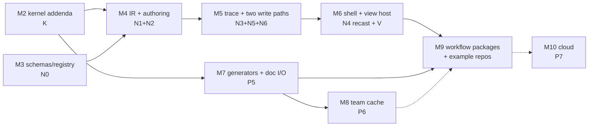

# FrameDiff — implementation plan: kernel → shell → user space

> **Historical plan.** Use [ARCHITECTURE.md](./ARCHITECTURE.md) for the implemented system and
> [README.md](./README.md) for the documentation authority map.

> **Status:** master plan v1 · **Date:** 2026-07-03 · **Owner:** Vikas Reddy
> **Supersedes (sequencing only):** the phase tables in [COMPOSITION-GRAPH.md §8](COMPOSITION-GRAPH.md)
> and [NODE-TIMELINE-GUI.md §12](NODE-TIMELINE-GUI.md) — their *content* stands; this doc re-sequences
> both under the [WORKFLOWS-AS-VIEWS.md](WORKFLOWS-AS-VIEWS.md) model and the audited refinements
> (doc bindings · derive⇒artifact⇒render · chapters-as-docs · two write paths).
> **North-star UX:** the [prototypes](../prototypes/README.md), especially
> [three-workflows](../prototypes/three-workflows/) and [platform-diagram](../prototypes/platform-diagram/).

---

## 0. Where we actually are (audited 2026-07-03)

Built and in `main` (with tests):

| Area | State |
|---|---|
| **M0/M1** | Deterministic in-browser render proven; code-driven preview shipped (`Player`/`Studio`, HMR) |
| **P0 contracts** | `canonicalJSON`, BLAKE3 `hash`, `fingerprint` + completeness test, graph `schemas` — **partial**: no `lockfile.ts`, no `jobs.ts` (durable job records), no local `buildIndex` |
| **P1 assets** | `assets/`: manifest, resolver (+test), local `cas.ts`, `AssetProvider` |
| **P2 graph** | `graph/planner.ts` (`defineComposition`/`plan`/`Artifact`), `scheduler.ts` (validate/topo) |
| **P3 precomps** | `nodes/precomp.ts`, `mediaBundle.ts`, cache-by-fingerprint baking |
| **P4 effects** | `effects/`: grade + `GradedVideo`, 3D `lut`, `homography`/`VideoPlane` (corner-pin), `scene3d`/`VideoPlane3D` (camera + DoF), bloom/vignette — exercised by the hero-reel |
| **Examples** | demo, determinism-check, hero-lower-third, hero-reel |

Not built: **P5** generators/durable jobs, **P6** team cache, **P7** cloud, **all of N0–N7** (GUI), and
the **V-track** (docs · views · shell · workflow packages) this plan introduces.

## 1. What we're building (one paragraph)

The three-layer platform of the diagrams: a **kernel** (files→fingerprints, the graph, derive⇒artifact⇒render,
CAS+lock) that never grows genre features; a **studio shell** that hosts **views**; and **user space** —
docs, `defineView` files, and library/workflow packages per repo. Every surface reads by querying/joining
nodes + docs and writes through **exactly two paths** (param bindings → literal rewrite; doc/placement
span rewrites). The three example workflows (episodic, simple cut, podcast) become real repos and serve
as the acceptance tests that the model holds.

## 2. Workstreams

- **K — kernel gap-close & doc contract** (finishes P0, adds `ctx.doc`)
- **N — the round-trip** (N0–N6: schemas → IR → trace → codemods), recast so its GUI surface ships as views
- **V — shell, views, docs subsystem, workflow packages** (new)
- **G — generators & team sync** (P5, P6)
- **C — cloud** (P7, unchanged, last)

Milestones interleave these. Numbering continues the repo's M-series.



Parallelism: **M3 ∥ M2**, and **M7 (generators) can proceed alongside M4–M6** — it depends only on M2.
The critical path to the product experience is M2→M4→M5→M6→M9.

---

## 3. Milestones

### M2 — Kernel gap-close + the doc contract  *(size S–M)*
The un-landed P0 pieces, plus the smallest additions the views model needs from the kernel.

Build:
1. `graph/lockfile.ts` — `framediff.lock` pins (`fingerprint → contentHash`), conflict policy
   (keep-first, `--force`, `--rerun`), prune; **not** an input to fingerprints (tested).
2. `graph/buildIndex.ts` — local, uncommitted `fingerprint → contentHash` memo.
3. `graph/jobs.ts` — durable job-record schema + state machine (submitted/running/succeeded/failed),
   resume resolution order (pin → CAS → record → submit-with-idempotency-key).
4. **Docs subsystem, kernel half** (`docs/` module):
   - block grammar: markdown headings annotated `{#id key=val …}`; parser yields
     `{id, attrs, text, span}` with **byte-exact spans**; parse→print round-trips byte-identically.
   - `ctx.doc(path[, "#blockId"[, ".field"]])` as a declarable build input: resolves to bytes
     (whole file or block slice), folds into fingerprints like asset content hashes.
   - one `SourceRef`/span schema shared by code and docs (the codemod layer and the doc writer
     consume the same shape).
5. **Artifact kinds** formalized: `media | data | doc` — a bake node may emit structured JSON
   (`cues.json`) or doc bytes, not just video. (This is the R2 derive⇒artifact⇒render enabler.)
6. Extend the **fingerprint-completeness property test**: mutating any doc byte in a declared slice
   flips the fingerprint; bytes outside the slice don't.

Exit criteria: property tests green cross-machine; lockfile proven non-input; a hand-written bake
node emits a `data` artifact that a component reads; doc parse/print byte-stable on the three
example doc formats (beats/script/rundown).

### M3 — Registry & param schemas (N0)  *(size S, parallel with M2)*
`defineNodeType` with `ParamFieldSchema` for every shipped node: colorGrade, lut, cornerPin,
**plane3d** (the NODE-TIMELINE-GUI §8 orbit/dolly/pan + DoF mapping over `scene3d` — including the
°→rad and orbit→eye/target desugar), video, audio (volume/fades), text, sequence, composite.
Dev-only `<Inspector>` that renders controls from a schema.

Exit: every shipped effect/source has a schema; the dev inspector edits a hand-built node live;
`fingerprintRecipeVersion` present on each type.

### M4 — One IR: SceneDoc + interpreter + authoring layer (N1 + N2)  *(size M)*
Build:
1. `SceneDoc` IR exactly per NODE-TIMELINE-GUI §4 (nodes, typed ports, `ParamBinding`,
   `TemporalPlacement`, `fieldSources`), **plus** the audited additions: `ParamBinding` gains
   `{kind:"doc", ref}` (reads a doc block field; resolves through the M2 parser; folds bytes into
   fingerprints), and *markers are not node types* — temporal annotations come from doc joins.
2. Interpreter: IR → the existing React components (registry `component`s), mounted under the
   proven `FrameProvider`/`exportVideo` seam. No new render path.
3. Authoring layer `<Scene>/<Track>/<Clip>/<Effect>/<Output>/<Sound>` (N2): source/effect
   separation, effects attachable at clip/track/output, optional windows.
4. Port one hero-reel shot to the authoring layer.

Exit: hand-written SceneDoc renders **and exports byte-identically** to its JSX twin (golden-frame);
a clip with whole-clip grade + windowed vignette + output adjustment renders identically; a
`doc`-bound param renders from a beats.md field and re-fingerprints when the doc changes.

### M5 — Trace + the two write paths (N3 + N5 + N6 + the doc writer)  *(size L — the hard one)*
Build:
1. **Trace** (code→model): declarative components register SceneNodes + `fieldSources` during a
   trace render; opaque `custom` nodes for arbitrary JSX; symbol resolution (follow `params={GRADE}`
   to the literal island; shared-by-N detection).
2. **Write path ① — param bindings**: AST codemod rewriting exactly one literal (params, then
   `from`/`durationInFrames`/`trimStart` placement literals); deterministic printing; computed
   values read-only with **materialize** action; shared values get **edit-all / fork**.
3. **Write path ② — span rewrites**: the doc writer (same `SourceRef` shape) rewriting one block
   field/text range; and placement-literal rewrites reuse ①'s machinery.
4. **Reconciliation**: in-memory model authoritative during a session; debounced serialization; HMR
   re-trace with echo suppression + dirty flags (the §9 policy, implemented once for code *and* docs).

Exit (each is a demo): drag a slider → `GRADE.vignette` literal updates, clean one-line diff,
preview follows; trim a clip via API → placement literal updates; edit a beats.md field via API →
only that span changes; hero-reel round-trips idempotently (trace→edit→re-trace ≡ fixpoint);
edit-all/fork works on the shared GRADE.

### M6 — Studio shell + the view host (N4 recast + V1)  *(size M–L)*
Build:
1. `defineStudio` / `framediff.config.ts`; `@framediff/studio` extracted from core (shell chrome:
   rail, preview, playback, sync placeholder; view host with tabs).
2. `defineView({id, title, query, component})`; **actions = `{setParam, editDoc, focus…}` and
   nothing else** — no model handle escapes (the no-third-write-path rule is API-shaped, not
   review-shaped).
3. Query/join API: `p.compositions`, `p.temporalNodes()`, `p.doc(path).blocks`, `join(…, on(link))`,
   link resolution both directions (doc `comp=` attrs; node `ctx.doc` inputs).
4. **Built-ins reimplemented as views**: inspector (schema-driven, from M3), timeline
   (clips/lanes/scrub; drags call write path ①), node graph (read-only).
5. A **repo-local example view** (storyboard over `beats.md`) in an example project — proving
   user-space views without shipping a workflow package yet.

Exit: the shipped timeline/inspector are literally `defineView` modules; the example repo's
storyboard view joins beats.md ⇄ comps, edits a doc field and a gen param through the two actions;
grep-level check: no view imports anything mutable but the two actions.

### M7 — Generators, durable jobs, doc I/O (P5 + R2)  *(size L, parallel from M2)*
Build:
1. `@framediff/generate`: provider interface, durable runner over `graph/jobs.ts` (idempotency keys,
   resume/poll, never double-submit), progress surface for CLI + Studio.
2. `@framediff/three`: `render3d` — glTF + animation clip → deterministic frame capture → media
   artifact (generalizes the T-rex path; `scene3d` stays the frame-tier sibling).
3. A v2v adapter (seedance-style), keyed on `(provider, model, revision, prompt, seed,
   inputContentHashes)`.
4. **Derive⇒artifact⇒render in practice**:
   - `align` generator: (VO audio hash + `ctx.doc("script.md")` + style ref) → `cues.json` **data**
     artifact; pure `<Captions cues style/>` component renders it (styling never re-calls the API).
   - `Generate → doc` (`into:"transcript.md"`): artifact materialized into an editable doc via the
     M2 writer, provenance chip retained.
   - audiogram = library comp baked as a precomp over (master segment + quote + template) — **no
     new node kind**; exercise of P3 machinery.
5. CLI: `framediff jobs list/resume`, `framediff bake`, `--rerun`.

Exit: 3D → v2v → composition e2e, cached, crash-resume without re-paying; captions restyle with
zero API calls; editing one script line stales captions and nothing else (the flagship staleness
demo); transcript generate→materialize round-trip.

### M8 — Team cache & sync (P6)  *(size M)*
`@framediff/cache-remote` (S3/GCS, BYO creds); `framediff assets push/pull`, `framediff cache push/pull`;
lock promotion flow (explicit, no churn from ordinary renders); hash-verify every fetched byte;
GC with pinned protection; the Studio sync chip goes from placeholder to real (unpushed count,
push, teammate-pull visibility).

Exit: the COMPOSITION-GRAPH §5.4 story verbatim — A bakes + pushes + commits; B clones, pulls,
renders **zero re-bakes, zero re-paid API calls, byte-identical**; corrupt/foreign bytes rejected.

### M9 — Workflow packages + the three example repos (V2)  *(size M)*
Build:
1. `@framediff/story`: beats/script doc formats (parsers registered on the M2 grammar), storyboard +
   script views, character-package convention (`defineCharacter` sugar over folder: backstory doc +
   stills + angle-set bake + prompt const).
2. `@framediff/podcast`: rundown/transcript formats, rundown + transcript views — transcript view's
   `rippleCut(word)` **desugars to placement-literal rewrites** (write path ①/② only); chapters
   join `rundown.md` (no marker nodes); ducking ships as sugar over a sidechain-input effect node.
3. Three real example repos under `examples/` (episodic / simple-cut / podcast), replacing the
   prototypes' hard-coded data with real projects that `framediff.config.ts`-mount their views.
4. Retire-by-pointer: prototypes stay as design artifacts; READMEs link to the live examples.

Exit: the three prototypes' hero flows reproduced on the real engine — beat edit re-bakes exactly
one scene; simple-cut runs with an empty config (**zero-tax check: no docs, no views, kernel
invisible**); striking a filler word in the podcast rewrites `trimStart/duration` literals, ripples
the timeline, and stales only downstream gen nodes.

### M10 — Cloud (P7)  *(size XL, own sub-design before start — unchanged from COMPOSITION-GRAPH)*
Cloud worker protocol, shardable bake jobs, remote job registry, signing/provenance, pinned images.
Prereq: M7+M8 stable. The bake-node/job-record seam built in M2/M7 is the handoff point.

---

## 4. Vertical slices (pull forward to de-risk)

| Slice | Proves | Lands inside |
|---|---|---|
| **S1** `cues.json` → `<Captions/>` with a *hand-authored* data artifact | artifact kinds + derive/render split, no API needed | M2 |
| **S2** vignette slider → literal rewrite on the hero-reel `GRADE` | write path ①, trace, reconciliation — the N-plan's thin slice, unchanged | start of M5 |
| **S3** storyboard view over `beats.md` (read + one doc-field edit) | view host, joins, write path ② | start of M6 |
| **S4** `align` keyed on doc bytes (stub provider, deterministic fake) | doc-as-input staleness end-to-end before paid providers | start of M7 |

If any slice fights back, the model gets revisited **before** the milestone builds out around it.

## 5. Package layout (end-state)

```
packages/
├─ framediff/               # kernel: graph, assets, docs, nodes, effects, render (lean deps)
├─ framediff-studio/        # shell + view host + built-in views (extracted at M6)
├─ framediff-three/         # render3d (M7)
├─ framediff-generate/      # provider adapters + durable runner (M7)
├─ framediff-cache-remote/  # S3/GCS remote CAS (M8)
├─ framediff-story/         # workflow pkg: doc formats + views (M9)
└─ framediff-podcast/       # workflow pkg: doc formats + views (M9)
examples/
├─ demo · determinism-check · hero-lower-third · hero-reel      (existing)
└─ episodic · simple-cut · podcast                              (M9, from the prototypes)
```

Discipline unchanged from COMPOSITION-GRAPH §6.1: heavy/impure tiers are opt-in packages; core
stays dependency-light; examples consume `framediff` exactly as an external user would.

## 6. Invariants that gate every merge

1. **Determinism contract (PRD §11)** — frame phase pure; all impurity quarantined in bake nodes.
2. **Two write paths only** — any `actions.*` addition must provably desugar to bindings or span
   rewrites; no view receives a model handle. API-enforced (M6), review-enforced after.
3. **One authority per fact** — new features name the single home of each fact (literal, doc field,
   or artifact); joins, never copies.
4. **Fingerprint completeness** — every input class (now including doc slices) covered by the
   mutation property test.
5. **Zero tax for the simple project** — the simple-cut example runs with an empty config forever;
   any change that makes it need one is wrong.
6. **Golden frames** — IR/interpreter/effect changes ship with byte-identical export tests.

## 7. Risks (delta to the risk registers in the source docs)

1. **M5 is the schedule risk** (trace + codemod + reconciliation — what sank v1). Mitigation: S2
   first; idempotent-fixpoint tests; island-only rewrites; ship read-only surfaces early.
2. **View/query API creep.** Mitigation: query helpers live in `@framediff/studio`, not kernel;
   the two-actions rule is type-level.
3. **Word-level alignment volume** (podcast): timings stay in the pinned artifact; materialized doc
   stores text + anchors; join by content hash (WORKFLOWS-AS-VIEWS §6.3).
4. **Doc merge conflicts** on shared docs: block-scoped spans keep diffs local; same echo-suppression
   policy as code; document "one block, one owner" as team convention, not mechanism.
5. **Sidechain/bus audio work** (ducking desugar) is real DSP plumbing — scope it inside M9's
   podcast package, frame-tier only, before generalizing buses.
6. Carried unchanged: codeHash canonicalization across runners (C-G risk #1), generator provider
   semantics (#6), color correctness (#8), browser persistence for long jobs (#9 → M7 CLI-first).

## 8. Scope honesty

- **The shippable product** is M2–M6: code-first editor with local caching, full GUI round-trip,
  and user-space views — valuable with zero remote/generative dependencies.
- **M7–M8** make it a *paid-API-safe, team* product. **M9** makes it a *platform* (the workflow
  packages are also the proof, and the marketing).
- **M10 (cloud)** remains a separate sub-design; nothing before it depends on it.
- Deferred, unchanged: structural GUI authoring (N7+ — add/wire nodes, GUI-built comps), keyframe
  curve editors, camera gizmo, cross-project shared repos (multi-repo library versioning).

*End of master plan v1 — living document. P/N labels are retained for traceability to the source
specs; where this plan and they disagree on sequencing, this plan wins.*
