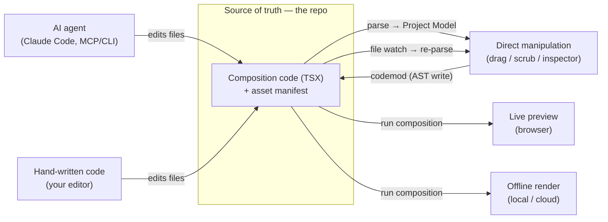
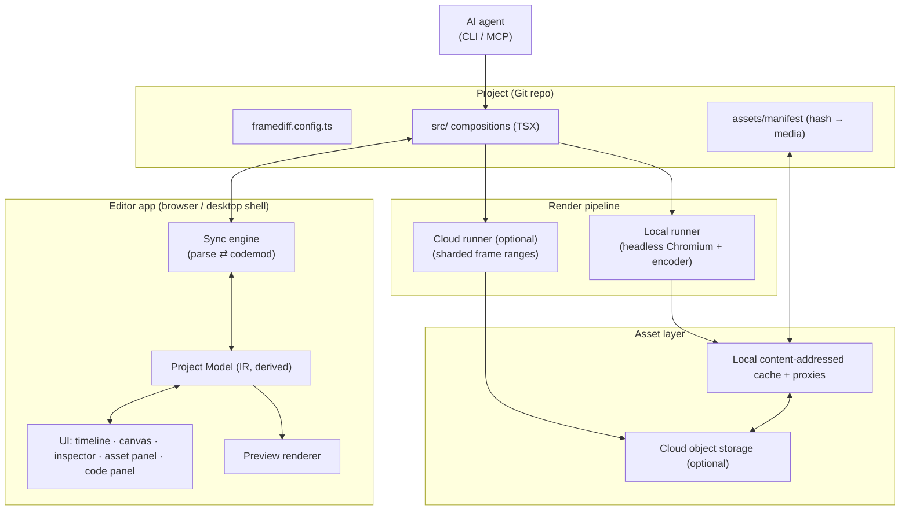

# FrameDiff — Product Requirements Document

> This document owns product intent and roadmap. The current code-level architecture and package
> boundaries are canonicalized in [ARCHITECTURE.md](./ARCHITECTURE.md).

> **Status:** Draft v0.1 · **Date:** 2026-06-23 · **Owner:** Vikas Reddy
> **Codename:** "FrameDiff" (placeholder — rename freely)
> **One-liner:** An open-source, code-first video editor where the project *is* a codebase, the visual UI is a live bidirectional view of that code, and AI agents (Claude Code et al.) are first-class editors. Overlays and effects are driven by HTML/CSS/WebGPU and rendered frame-by-frame, deterministically, on your machine — with optional cloud rendering.

---

## Table of contents

1. [TL;DR](#1-tldr)
2. [The core insight](#2-the-core-insight)
3. [Problem & why now](#3-problem--why-now)
4. [Goals & non-goals](#4-goals--non-goals)
5. [Target users & personas](#5-target-users--personas)
6. [Product principles](#6-product-principles)
7. [Key concepts & glossary](#7-key-concepts--glossary)
8. [The core loop: three editors, one source](#8-the-core-loop-three-editors-one-source)
9. [System architecture](#9-system-architecture)
10. [Functional requirements](#10-functional-requirements)
11. [Non-functional requirements](#11-non-functional-requirements)
12. [Recommended tech stack](#12-recommended-tech-stack)
13. [Roadmap & milestones](#13-roadmap--milestones)
14. [Success metrics](#14-success-metrics)
15. [Risks & open questions](#15-risks--open-questions)
16. [Appendix](#16-appendix)

---

## 1. TL;DR

FrameDiff is a video editor with three ways to edit the same project — **direct manipulation** (drag/scrub/click in a GUI), **code** (the project is a real, typed codebase), and **AI agents** (Claude Code and friends edit the code on your behalf) — all backed by a single source of truth: **the code**.

- The project is a Git repository of composition code (React/TSX) plus a content-addressed media manifest.
- The visual editor is a *projection* of that code. UI actions are codemods that rewrite the source; code edits (by a human or an AI) flow back into the UI and preview live.
- Overlays, titles, and layout are authored in HTML/CSS. Video transforms, transitions, and shader effects run on WebGPU. Frames are composited and rendered deterministically — locally by default, in the cloud optionally.
- v1 ships as a polished **open-source developer tool**: great DX, typed component API, a CLI/MCP surface for AI agents, and a render pipeline that runs the *exact same composition code* in preview and in final export.

The bet: programmatic video proved code-as-video works but stayed code-only; traditional NLEs (Premiere, DaVinci, CapCut) are GUI-only and unscriptable. FrameDiff is the bridge — and because the source of truth is code, **AI agents can edit video as naturally as they edit any codebase.**

---

## 2. The core insight

**Everything is backed by code, and the code is the single source of truth.** The GUI is not a separate document that exports code; it is a live, editable *view* over the code. An AI agent is not a bolted-on chatbot; it edits the same code the GUI edits.

This yields three properties no mainstream editor has together:

| Property | Why it matters |
|---|---|
| **Diffable & versionable** | Video projects live in Git. Review changes, branch, merge, roll back. |
| **Composable & reusable** | A "lower-third" or "intro" is a typed component you import across projects. |
| **Programmable & AI-native** | The code is the API. Agents automate, batch, localize, and edit by editing code — no proprietary plugin SDK required. |

The UI exists so that the things code is *bad* at — precise visual nudging, scrubbing, eyeballing timing, picking colors — are fast and tactile. The code exists so that the things GUIs are *bad* at — reuse, automation, versioning, and being driven by an AI — are first-class.

---

## 3. Problem & why now

### The gap

- **Programmatic video tools** prove that code can drive deterministic, high-quality video. But they are *code-only*: no real direct-manipulation editing, a steep barrier for non-developers, and tedious for developers doing fine visual tweaks (you can't just drag the title 4px left).
- **Traditional NLEs (Premiere, Final Cut, DaVinci, CapCut)** have superb direct-manipulation UX but are GUI-only: not scriptable, not version-controllable, not composable, and not automatable by an AI. Their "code" stories are closed plugin SDKs, not the project itself.
- **AI video tooling** today mostly means generative clips, not *editing*. Nobody can point Claude Code at a video project and say "tighten every cut by 3 frames and rebrand the lower-thirds" with reliable, reviewable results — because the project isn't code.

### Why now

- **LLMs are reliable code editors.** Agentic coding (Claude Code) makes "edit the video by editing code" a real workflow, not a demo — *if* the code surface is typed and constrained.
- **WebGPU is broadly available.** Shipped across Chromium (2023), Safari (2025), and Firefox — enough to drive real-time effects in the browser and in headless render.
- **WebCodecs is mature enough** in Chromium and recent Safari to decode/encode video frames directly, removing the historic dependence on slow `ffmpeg.wasm`-only paths (native ffmpeg remains an option for breadth/speed).
- **Programmatic video has already validated the model** (deterministic `f(frame) → pixels`, headless render, frame stitching) — and the source-available (non-MIT) licensing common in that space leaves a clear opening for a permissively-licensed, AI-native alternative.

> **⚠️ Clean-room constraint.** Some prior programmatic-video tools are **source-available, not MIT/Apache** — we treat them strictly as a *market signal*, never as a source to read or reuse. FrameDiff is implemented **clean-room** from primary public specs (WebCodecs, WebGPU, HTML/CSS, ffmpeg) with its **own API design**. No third-party source, snippets, or copied API surface. Every third-party dependency must be license-audited (MIT/Apache/BSD-compatible) before adoption. See §15.

---

## 4. Goals & non-goals

### Goals (v1)

- **G1 — Prove the core loop:** a single project where a UI edit, a hand-written code edit, and an AI code edit all mutate the same source and are reflected in the UI and preview.
- **G2 — Code is source of truth, round-trippable:** a constrained, statically-analyzable component API that the UI can parse into an editable model and write back without semantic drift.
- **G3 — Deterministic local render:** the same composition code that previews in the browser renders frame-by-frame to a video file via a local runner, with frame-accurate, reproducible output.
- **G4 — AI-native surface:** a typed component API + CLI/MCP tools (render, preview a frame, introspect the composition, validate determinism) that make an agent productive with zero custom glue.
- **G5 — HTML/CSS overlays + WebGPU effects:** authoring overlays in HTML/CSS and effects in WebGPU, composited per frame.
- **G6 — Ship as a credible OSS dev tool:** docs, examples, a `framediff` CLI, permissive license, and a plugin path for community effects/components.

### Non-goals (v1)

- **Not** a from-scratch generative-AI video model (we orchestrate edits; generation is a pluggable effect/source later).
- **Not** a full cloud SaaS with accounts/billing in v1 — cloud render and asset sync are *optional, opt-in* services; the tool is local-first.
- **Not** feature-parity with Premiere/DaVinci (no multicam, advanced color grading suites, etc. in v1).
- **Not** round-tripping *arbitrary* code into the GUI — only the blessed component API round-trips fully; arbitrary code degrades gracefully (see §9.3).
- **Not** a real-time multi-user collaboration engine in the free/local tier (Git is the collaboration model for v1; live multiplayer ships later as a *managed* feature — see business model).

### Business model (open core)

FrameDiff's core is OSS (MIT/Apache) and **local-first/free**: the editor, code↔UI sync, in-browser WebCodecs render, local file read/write, the companion CLI, and "bring-your-own-credentials" publish targets (local folder, your S3 bucket, a generic webhook).

Revenue comes from **managed, hosted services** layered on top — never gating the core local loop:

| Managed service | What it adds |
|---|---|
| **Cloud render farm** | Parallel sharded rendering for speed; pro codecs (ProRes/DNxHR) and long-form via server-side ffmpeg. |
| **Real-time collaboration** | Multiplayer co-editing over the shared code model. |
| **Managed file sync** | Large raw media synced across machines/teammates (beyond local + BYO-storage). |
| **Hosted versioning** | Project history, branches, and review as a service on top of Git. |
| **Managed publish connectors** | OAuth-handled delivery + scheduling to YouTube/TikTok/Instagram/etc. (vs BYO-webhook locally). |

---

## 5. Target users & personas

The product serves **technical creators and pro editors simultaneously**, with AI as the bridge between them.

### Persona A — "The technical creator" (primary, code-comfortable)
Developer/designer who wants programmatic power *and* a visual layer. Lives in the code, drops into the UI for visual nudges, uses AI for boilerplate. Wants reuse, Git, automation, data-driven video.

### Persona B — "The pro editor" (primary, code-averse but AI-driven)
Skilled editor who does **not** write code. Reaches the underlying code through **the UI and natural language**: "make the title bounce," "tighten this cut," "match the brand colors." The AI translates intent into code; the UI reflects it. Code is invisible to them but still the source of truth.

### Persona C — "The AI agent" (first-class, non-human user)
Claude Code or another agent. Its affordances are the repo, the TypeScript types, and the `framediff` CLI/MCP tools. It edits compositions, renders frames, inspects results visually, and validates determinism — the same way it works in any codebase. **Designing for this persona is the differentiator.**

### Persona D — "The team" (secondary)
A studio/marketing team running many variants of a template (localization, A/B, data-driven). They consume components built by A, arranged by B, automated by C, versioned in Git.

---

## 6. Product principles

1. **Code is the source of truth.** Every other surface (UI, AI, timeline) reads from and writes to code. No shadow state that can diverge.
2. **Preview is render.** The browser preview and the final export run the *identical* composition code. WYSIWYG is a determinism guarantee, not a hope.
3. **Determinism is a contract.** A frame is a pure function of `(frame number, project, assets)`. No wall-clock, no unseeded randomness, no `requestAnimationFrame`-driven state.
4. **The blessed path round-trips; the escape hatch degrades gracefully.** Constrained, analyzable components are fully editable in the UI. Arbitrary code still works — it just becomes an opaque block you can place but not visually edit.
5. **AI is a peer editor, not a feature.** If a human can do it via the UI or code, an agent can do it via the same code, with tools to see and verify its work.
6. **Local-first, cloud-optional.** Everything works offline on one machine. The cloud adds scale (render farm) and sync (large media), never a dependency for the basics.
7. **Permissively licensed, clean-room, and extensible.** MIT/Apache-2 for our code; a clean-room implementation from public specs (no source-available code read or reused — see §15); every dependency license-audited. Effects, sources, and components are a plugin ecosystem.

---

## 7. Key concepts & glossary

| Term | Definition |
|---|---|
| **Project** | A Git repo: composition code (`src/`), a `framediff.config.ts`, and an asset manifest. The unit of truth. |
| **Composition** | A named, renderable video definition: dimensions, fps, duration, and a root component. Multiple per project. |
| **Sequence** | A time-shifted, time-bounded region (`from`, `durationInFrames`) — the building block of the timeline. |
| **Track / Layer** | A visual/audio stack lane. Layers composite top-to-bottom; tracks group sequences in time. |
| **Clip** | A reference to source media (video/audio/image) with trim/playback-rate, placed in a sequence. |
| **Effect** | A transform applied to a layer or the frame: CSS-based (overlay tier) or WebGPU shader-based (effect tier). |
| **Project Model** | The in-memory IR parsed *from* code. A **derived cache**, not a second source of truth — always reconciled from code. |
| **Blessed API** | The constrained, statically-analyzable component library the UI round-trips perfectly (`<Sequence>`, `<Clip>`, `<Text>`, `<Effect>`, `<Animate>`, …). |
| **Escape hatch** | Arbitrary code outside the blessed API. Renders fine; appears as an opaque "code block" in the UI. |
| **Render runner** | The headless process that executes composition code frame-by-frame and encodes a video. |
| **Determinism contract** | The set of rules a composition must obey to render reproducibly (§11). |
| **Responsive composition** | A composition whose HTML/CSS layout adapts to the output canvas size, so one source renders correctly to 16:9, 9:16, 1:1, etc. The basis of multi-format publishing. |
| **Render target** | A named output spec in config: dimensions, codec, bitrate, duration cap, plus a destination. One composition → many targets. |
| **Connector / destination** | Where a rendered target is delivered: local folder, S3/GCS, generic webhook (local/free) or managed OAuth platforms like YouTube/TikTok (hosted). |

---

## 8. The core loop: three editors, one source



Every edit, regardless of origin, lands in the code. The UI and preview are continuously reconciled from the code. This is what "everything you do in code is reflected in the UX and vice versa" means concretely.

**The magic moment:** an editor (Persona B) says "make the title bounce when it enters." The AI (Persona C) edits the `<Animate>` keyframes in code. The UI timeline (Persona A's tool) instantly shows new keyframes, and the preview plays the bounce — all from one code change the editor never sees as code.

---

## 9. System architecture



### 9.1 The project is a repo

```
my-video/
├─ framediff.config.ts        # compositions, fps, dimensions, defaults + publish targets
├─ src/
│  ├─ Root.tsx              # registers compositions
│  ├─ Intro.tsx            # a composition / reusable component
│  └─ components/          # blessed components + custom escape-hatch code
├─ assets/
│  └─ manifest.json        # logical path → content hash → storage location
├─ public/                 # small committed assets (fonts, logos)
└─ package.json
```

Code lives in Git. Large media lives in the asset layer (content-addressed, synced on demand), referenced from the manifest — never committed as binaries. The editor is a **pure web app** that opens this folder directly via the browser's **File System Access API** (a persistent read/write handle) — no desktop shell.

### 9.2 Authoring layer (the blessed component API) — **framework decision**

**Decision: React/TSX for v1** (rationale in the chat summary and §15). The blessed API is a typed component library designed to be *statically analyzable* so the UI can round-trip it:

- **Structure:** `<Composition>`, `<Sequence from durationInFrames>`, `<Track>`, `<Layer>`.
- **Media:** `<Video src trim>`, `<Audio>`, ``, `<Text>`, `<Shape>`.
- **Motion:** `<Animate>` keyframe primitive and an `interpolate(frame, inputRange, outputRange)` helper — both readable/writable as timeline keyframes by the UI.
- **Effects:** `<Effect name="…" props={…}>` for WebGPU shaders; CSS for overlay styling.

Props should be literals or simple, analyzable expressions wherever possible — that's what lets the inspector edit them and write them back. Animation goes through `<Animate>`/`interpolate` so the timeline can present it as draggable keyframes.

> **Svelte alternative (documented, not chosen):** the entire architecture below is framework-agnostic except this section and the code examples. Swapping to Svelte 5 would re-implement the blessed components and the AST adapter; the sync engine, render pipeline, asset layer, and AI surface are unchanged. The cost of revisiting this decision is contained to one layer.

### 9.3 Sync engine (code ⇄ UI), round-trip strategy

Because code is the source of truth, the UI is a **projection**:

1. **Parse:** read TSX → AST (via `ts-morph`/Babel) → extract the composition tree into the **Project Model** (the derived IR).
2. **Project:** render the UI (timeline, layers, inspector) from the Project Model.
3. **Write back:** a UI edit becomes a structured mutation → an AST codemod that **preserves formatting and comments** → write file.
4. **Reconcile:** changes (UI-, human-, or **external agent**-originated) are detected via the **FileSystemObserver API** where available — falling back to polling the directory handle — then re-parsed to refresh the Project Model + UI + preview. An idempotency check confirms the written code re-parses to the intended model.

**Round-trip fidelity is the central engineering challenge.** Strategy:

- **Blessed subset → full round-trip.** Analyzable components/props are fully editable both ways.
- **Escape hatch → graceful degradation.** Arbitrary expressions/components render correctly but appear in the UI as opaque, placeable-but-not-visually-editable blocks (you can still set their position/timing if expressed via blessed wrappers).
- **Concurrent edits.** Debounce + AST-level merge; if the UI and a file change collide, last-writer-wins at the node level with a visible conflict marker. Git remains the durable conflict-resolution layer.

This honors "code is source of truth": the Project Model is never edited independently — it is always recomputed from code.

### 9.4 Rendering engine

**Principle: preview = render.** The same composition code runs everywhere; the *render runtime is a browser* — interactive (the user's tab) or headless (the companion CLI / cloud workers). Only frame capture and encoding differ from preview.

**Two compositing tiers:**

| Tier | Authored in | Composited by | Best for | Capture |
|---|---|---|---|---|
| **Overlay tier** | HTML/CSS | The browser's own compositor | Titles, lower-thirds, captions, layout, shapes — perfect CSS fidelity, **responsive to output size** | Composited viewport (incl. canvas) |
| **Effect tier** | WebGPU (WGSL) | The WebGPU pipeline on a `<canvas>` | Video color/transform, transitions, shader effects on the video texture | Read back the canvas/texture |

The compositor assigns each layer to a tier. For effects that must span DOM *and* video (e.g. a distortion warping the video and a caption together), the DOM layer is rasterized into a texture and run through WebGPU (accepting some CSS-feature limits — documented).

**Frame pipeline (per output frame `N`):**
1. Decode the exact source frame(s) at `N` via WebCodecs `VideoDecoder` (seek from nearest keyframe; handle GOP).
2. Set the frame number; the composition tree re-renders as a pure function of `N`.
3. Composite overlay tier + effect tier → final frame (`VideoFrame`).
4. Encode via WebCodecs `VideoEncoder` → mux with **mp4box.js** (MP4/H.264, HEVC where supported) or **webm-muxer** (WebM/VP9, AV1). Output written to disk via the File System Access API.
5. **Audio:** decode + mix deterministically in an `OfflineAudioContext`; encode via WebCodecs `AudioEncoder` (AAC/Opus); mux in sync.

> **Codec scope (local):** WebCodecs only — H.264/HEVC/VP9/AV1 video, AAC/Opus audio. **No ProRes/DNxHR locally** (no native ffmpeg in a pure-web app). Pro/intermediate codecs are a **cloud-render** feature (server-side ffmpeg) — one of the managed services.
>
> *Validated in the M0 spike: **AV1 is the preferred in-browser codec** — measured ~half the bitrate and noticeably cleaner low-contrast/flat-area output than H.264, with no flicker; **H.264 is the compatibility fallback**. (See [M0 FINDINGS](M0-FINDINGS.md).)*

**Local render (humans):** runs **in the browser tab** — off the main thread in a **Web Worker with `OffscreenCanvas`** so the UI stays responsive — and writes the output file via the File System Access API. No desktop shell, no Node.

**Headless render (agents / CI / cloud):** a companion **`framediff` CLI** (Node) runs the *same* web render bundle in **headless Chromium (Playwright)** to render frames/files without the GUI open. This is what an agent calls for visual feedback, and what the cloud farm runs at scale.

**Cloud render (managed):** split the frame range into shards across headless workers, render in parallel, stitch, and encode (incl. pro codecs via server ffmpeg). Determinism makes shards reproducible and cacheable; assets pulled from content-addressed object storage.

### 9.5 Asset management & cloud sync

- **Content-addressed:** media identified by hash → dedup, cache-friendly, reproducible. The manifest maps logical path → hash → storage location.
- **Proxies:** auto-generate low-res proxies for fast scrubbing in the editor; full-res used only at final render.
- **Local-first:** read source media straight from the user's disk via the File System Access API; cache content-addressed copies/proxies locally. **Managed file sync** (large media across machines/teammates) is an opt-in hosted service; locally you can also point at your own S3/GCS. Code in Git; large media out of Git.

### 9.6 AI-native surface

v1 is **bring-your-own-agent**: you run Claude Code (or any agent) in a terminal against the project repo — no in-app chatbot. Because the project is a typed codebase, the agent is productive with almost no glue. We provide:

- **Strong TypeScript types** for the blessed API (the agent's contract).
- **A `framediff` CLI + MCP server** exposing: `render` (full/range), `frame <n> --screenshot` (visual feedback), `inspect` (describe the current composition tree as JSON), `validate` (determinism + type lint), `new`/`add` scaffolds.
- **Visual feedback loop:** the agent renders a frame, *sees* the PNG, and self-corrects — the same perceive-act loop a human uses.
- **Live reflection:** agent edits hit the files → the editor detects them (FileSystemObserver/polling) and updates the UI/preview instantly, so a human watching the GUI sees the AI work in real time.

### 9.7 Publish & syndication

One composition fans out to many platforms. Because overlays are **HTML/CSS, compositions are responsive** — the same source re-lays-out for 16:9, 9:16, or 1:1 without manual reframing (set safe areas / focal points where needed).

- **Render targets (in code):** `framediff.config.ts` declares targets — dimensions, codec, bitrate, duration cap, and a destination. `render --target youtube-4k,reel-9x16` renders all renditions in one pass.
- **Presets:** built-in platform presets (YouTube, Shorts/Reels/TikTok 9:16, X, LinkedIn, square) — editable, versioned in the repo.
- **Destinations:** local folder, your own S3/GCS, or a generic webhook — all **free/local** (bring your own credentials). **Managed connectors** (OAuth-handled YouTube/TikTok/Instagram + scheduling) are a hosted service.
- **Pipeline:** render → optional post-process → deliver, with per-target status; schedule publish times via the managed tier.

---

## 10. Functional requirements

Priorities: **P0** = MVP / core-loop, **P1** = v1, **P2** = post-v1.

### 10.1 Editor UI
- **P0** Timeline with tracks/layers, sequences, zoom, scrub, playhead, snapping.
- **P0** Canvas preview with frame-accurate playback and a frame stepper.
- **P0** Inspector panel: edit selected element's analyzable props; writes back to code.
- **P0** Asset panel: browse, import, preview media; shows proxy/sync status.
- **P0** Code panel: embedded code view, edits sync live (read-write).
- **P1** Drag to reposition/resize on canvas → codemod to props.
- **P1** Keyframe editor in the timeline (reads/writes `<Animate>`/`interpolate`).
- **P2** Multi-composition navigation, nested compositions on the timeline.

### 10.2 Compositions & timeline
- **P0** Define compositions (dimensions, fps, duration) in `framediff.config.ts`.
- **P0** Place/trim/move clips; split, ripple-delete; layer ordering.
- **P1** Transitions between sequences (effect-tier).
- **P2** Markers, regions, nested/precomposed sequences.

### 10.3 Effects & overlays
- **P0** HTML/CSS overlays (text, shapes, layout) authored in blessed components.
- **P0** A starter WebGPU effect set (color adjust, blur, transform, basic transition).
- **P1** Custom WebGPU (WGSL) effects via `<Effect>` with typed props.
- **P2** Effect plugin marketplace/registry.

### 10.4 Animation
- **P0** `interpolate()` + `<Animate>` keyframes; easing presets.
- **P1** Spring/physics easing; timeline keyframe drag-edit.
- **P2** Expression/driver links between properties.

### 10.5 Code editing & sync
- **P0** Bidirectional sync for the blessed subset (UI ⇄ code), formatting-preserving.
- **P0** Live file-watch re-parse (human/AI code edits reflect in UI).
- **P1** Graceful escape-hatch handling (opaque blocks).
- **P1** Conflict markers on concurrent edits.

### 10.6 AI integration (bring-your-own-agent)
- **P0** `framediff` CLI: `render`, `frame --screenshot` (headless Chromium), `inspect`, `validate`.
- **P0** Typed component API as the agent contract; the agent edits the repo directly (Claude Code in a terminal).
- **P1** MCP server wrapping the CLI so in-editor/desktop agents get the same tools.
- **P2** *(Deferred)* In-app chat / agent-suggested edits with diff preview — not in v1; the agent is external.

### 10.7 Assets & sync
- **P0** Read source media from disk via File System Access; local content-addressed cache + proxy generation.
- **P0** Point at your own S3/GCS with your credentials (free/local).
- **P1** *(Managed)* Hosted file sync across machines/teammates.
- **P2** *(Managed)* Team-shared asset libraries.

### 10.8 Rendering & export
- **P0** Deterministic **in-browser** render to MP4/H.264 (WebCodecs, off-main-thread); write file via File System Access.
- **P0** Headless render via the `framediff` CLI (same bundle, headless Chromium) for agents/CI.
- **P1** More in-browser codecs (HEVC where supported, WebM/VP9, AV1); render a frame range; still-frame (PNG) export.
- **P2** *(Managed)* Cloud sharded render + pro codecs (ProRes/DNxHR via server ffmpeg); render queue/status UI.

### 10.9 Project & versioning
- **P0** Project = Git repo; `framediff new` scaffolds it.
- **P1** In-app awareness of Git state (dirty/clean, branch); render a specific commit.
- **P2** Visual diff of two commits (frame-compare).
- **P2** *(Managed)* Hosted versioning: project history, branches, and review beyond raw Git.

### 10.10 Extensibility
- **P1** Plugin API for custom blessed components and `<Effect>`s.
- **P2** Published-plugin registry; templates gallery.

### 10.11 Audio
- **P0** Include/trim multiple audio tracks & clips; per-clip gain; deterministic multi-track mix (`OfflineAudioContext`); export in sync (AAC/Opus).
- **P1** Fade in/out; waveform display in the timeline; volume keyframes; mute/solo.
- **P2** Audio effects (EQ, compression, ducking, noise reduction); audio-effect plugins.

### 10.12 Publish & syndication
- **P0** Multi-target render from one composition (responsive 16:9 / 9:16 / 1:1); platform presets.
- **P0** Deliver to local folder, your own S3/GCS, or a generic webhook (free/local).
- **P1** Per-target reframe controls (safe areas / focal point); render-target config in code.
- **P2** *(Managed)* OAuth connectors (YouTube/TikTok/Instagram/…) + scheduled publishing.

### 10.13 Collaboration & managed services
- **P0** Git is the collaboration & versioning model for the free tier.
- **P2** *(Managed)* Real-time multiplayer co-editing; hosted sync/versioning; cloud render farm.

---

## 11. Non-functional requirements

### 11.1 Determinism contract (hard requirement)
A composition **must** render reproducibly. The runtime enforces/lints:
- Frame state is a pure function of the current frame — **no** `requestAnimationFrame`/`setInterval`-driven state, **no** `Date.now()`/wall-clock, **no** unseeded `Math.random()` (provide a seeded RNG + deterministic noise).
- Fonts and external resources must be loaded/embedded before capture (no race-dependent layout).
- **Color range must match** between preview and export. The M0 spike found WebCodecs tags output as *limited* range (16–235) by default while the canvas is *full* range (0–255) — a real preview≠export gap. The renderer must signal full range (or convert) so the exported colors match the preview.
- **GPU nondeterminism risk:** shader output can vary across GPU/driver, which matters for *distributed* cloud render. Mitigations: pin cloud workers to identical GPU/driver images; offer a consistent software path for diff-sensitive content; keep *timeline/layout* fully deterministic even where pixel-exact shader output isn't guaranteed cross-machine.

### 11.2 Performance targets (initial, to validate)
- Editor scrubbing on proxies: ≥ 24 fps interactive preview at 1080p on a typical laptop.
- Local render throughput: a clear frames/sec baseline per effect complexity; parallelizable across cores/cloud shards.
- Sync latency: UI edit → code write → re-parse → UI refresh under ~150 ms for typical edits.
- In-browser render runs off the main thread (Worker + `OffscreenCanvas`) so the editor stays usable; long/large renders are the cloud farm's job.

### 11.3 Other
- **Offline-first:** all core features work with no network.
- **Browser support:** pure web app requiring the **File System Access API** → **Chromium-only for v1** (Chrome/Edge/Brave/Arc) on macOS/Linux/Windows. Safari/Firefox lack the directory read/write API; revisit as they adopt it. The headless render path uses Chromium too.
- **Security:** rendering executes project code — sandbox the render context; treat third-party plugins/effects as untrusted.
- **Accessibility:** keyboard-navigable timeline/inspector; respects reduced-motion in the *editor UI* (not in rendered output).
- **Reliability:** renders are resumable/cacheable by frame range; a crashed shard re-renders deterministically.

---

## 12. Recommended tech stack

| Layer | Choice | Notes |
|---|---|---|
| Authoring | **React + TypeScript** | LLM fluency (dominant reason) + the `f(frame)` render model fits React naturally. Clean-room — our own API, no third-party source (§15). |
| Editor UI | **SvelteKit + Svelte MVVM** | Svelte views and ViewModels over framework-free managers; React is isolated to the composition preview/probe/export runtime. |
| AST / codemod | **ts-morph** (or Babel + recast) | Formatting/comment-preserving round-trip. |
| Effects | **WebGPU (WGSL)** | `<canvas>`-driven; framework-agnostic. |
| Overlays | **HTML/CSS** | Browser-composited; screenshot capture. |
| Decode/encode | **WebCodecs** + **mp4box.js / webm-muxer** | In-browser; no native ffmpeg locally. Server ffmpeg only in managed cloud render. |
| Audio | **Web Audio `OfflineAudioContext`** | Deterministic offline mixing. |
| Render runtime | **Browser**: Worker + `OffscreenCanvas` (interactive) · headless Chromium/Playwright (CLI & cloud) | Same web bundle everywhere; preview = render. |
| Local file access | **File System Access API** (+ **FileSystemObserver** where available, poll fallback) | Pure web — no Tauri/Electron desktop shell. |
| Assets | Local content-addressed cache + **your S3/GCS** (or managed sync) | Proxies generated via WebCodecs. |
| Cloud (managed) | Sharded headless workers + **server ffmpeg** | Scale, pro codecs, collaboration, sync, publish connectors. |
| AI surface | `framediff` CLI + **MCP server** | `render` / `frame` / `inspect` / `validate`. |
| License | **MIT or Apache-2.0** | Deliberately permissive vs the source-available licensing common in this space; our code is clean-room. |

---

## 13. Roadmap & milestones

| Milestone | Goal | Exit criteria |
|---|---|---|
| **M0 — Spike (deterministic render)** | Prove `f(frame) → pixels` end-to-end | A hardcoded composition renders frame-by-frame to MP4 **in the browser** (WebCodecs), writing the file via File System Access; preview matches export. **Spec: [M0-SPIKE.md](M0-SPIKE.md).** |
| **M1 — The core loop (P0)** | One source, three editors | UI edit, hand edit, and external-agent edit all mutate the same blessed-API code and reflect in UI + preview (FileSystemObserver). Inspector + timeline round-trip. |
| **M2 — Effects, overlays & audio** | HTML/CSS overlays + WebGPU effects + basic audio | Starter effect set, `<Effect>` custom WGSL, keyframe editor, transitions; multi-track audio mix + waveforms. |
| **M3 — AI-native + assets** | Agent productivity + media at scale | `framediff` CLI/MCP (headless render, frame-screenshot), local file read via FS Access, content-addressed cache + WebCodecs proxies. |
| **M4 — Publish & community (OSS launch)** | Multi-format output + ecosystem | Responsive compositions; multi-target render; deliver to local/S3/webhook; plugin API; docs, examples, templates; public OSS launch (MIT/Apache). |
| **M5 — Managed services (commercial)** | Scale + collaboration + monetization | Cloud render farm (pro codecs); real-time collaboration; managed file sync; hosted versioning; OAuth publish connectors + scheduling. |

---

## 14. Success metrics

**Activation & core loop**
- Time-to-first-rendered-frame (install → first export).
- % of new projects that reach a successful export.
- **AI-edit success rate:** % of agent edits that compile + render without error.
- **Round-trip fidelity (internal):** % of UI edits that re-parse to the intended model with zero semantic drift.

**Engagement & retention**
- Weekly active projects; retained creators (W1/W4).
- Renders completed per active project.

**OSS health**
- GitHub stars, forks, external contributors, published plugins.
- Render reliability (% completing without error) and throughput (frames/sec).

---

## 15. Risks & open questions

### Risks
- **Round-trip fidelity / formatting preservation** — the classic hard problem (Webflow/Figma Dev Mode territory). *Mitigation:* constrain the blessed subset; degrade arbitrary code gracefully; never edit the IR independently of code.
- **DOM ⇄ WebGPU cross-layer compositing** — perfect CSS fidelity *and* shader effects spanning DOM+video conflict. *Mitigation:* two-tier model; rasterize DOM to texture only when an effect must span tiers; document CSS limits in that path.
- **WebCodecs/codec coverage & cross-browser variance** — *Mitigation:* Chromium render target for v1; native ffmpeg for breadth; document Safari/Firefox gaps.
- **Determinism leaks** — fonts, timing, **GPU/driver variance** in distributed render. *Mitigation:* enforced determinism lint; pinned worker images; consistent software path for diff-sensitive content.
- **Per-frame DOM screenshot performance** — *Mitigation:* WebGPU for heavy effects; proxies for editing; cloud parallelism for final render.
- **Framework bet (React vs Svelte)** — contained to the authoring layer (§9.2); revisitable.
- **Scope** — "everything in code reflected in UI and vice versa" is enormous. *Mitigation:* the blessed-subset constraint makes it tractable; escape hatch absorbs the long tail.
- **Licensing / clean-room discipline** — some prior tools in this space are **source-available, not MIT/Apache**: we must **not** read or reuse their code, snippets, or copied API surface. *Mitigation:* implement clean-room from primary specs (WebCodecs/WebGPU/HTML/CSS/ffmpeg); design our own API; license-audit every dependency; keep a provenance note. Re-deriving the deterministic-render edge cases from scratch is real work — that's the cost of the permissive, AI-native differentiator.

### Decisions (resolved 2026-06-23)
1. **Pure web app** — no desktop shell; local files via the **File System Access API** (+ FileSystemObserver for live external-edit detection).
2. **WebCodecs** is the local encode path (mp4box.js/webm-muxer); native ffmpeg lives only in the managed cloud tier.
3. **Audio (v1):** include/trim/mix multiple tracks, per-clip gain + fades, deterministic `OfflineAudioContext` mix, waveforms, AAC/Opus export. Audio *effects* (EQ/compression/ducking) deferred.
4. **Bring-your-own-agent** — no in-app chatbot in v1; agents edit the repo and use the `framediff` CLI/MCP.
5. **Monetization = managed services:** cloud render, real-time collaboration, file sync, hosted versioning, and OAuth publish connectors (open-core; the local loop stays free).
6. **Publish/syndication** is a first-class feature: responsive multi-format render → local/S3/webhook (free) or managed connectors.

### Open questions
1. **`FileSystemObserver` availability** — confirm current Chrome support; ship the polling fallback regardless.
2. **Agent visual feedback in pure-web** — confirmed approach is a Node companion CLI driving headless Chromium. Acceptable, or do we want the agent to drive the user's *open tab* instead?
3. **Chromium-only for v1** — acceptable given File System Access is unsupported in Safari/Firefox? (Affects addressable users.)
4. **Long-render UX in a tab** — the tab must stay open; how do we handle accidental close / throttling before the cloud farm exists?
5. **Smart reframing** for 9:16 ↔ 16:9 — manual safe-areas in v1, or invest early in auto-reframe (subject tracking)?
6. **Which publish connectors first** (YouTube, TikTok, Reels, …), and is scheduling in the first managed release?

---

## 16. Appendix

### 16.1 Example composition (blessed API, illustrative)

> API names below are **FrameDiff's own clean-room design** (illustrative, TBD) — not derived from any source-available project.

```tsx
// src/Intro.tsx
import { Composition, Sequence, Video, Text, Animate, Effect, interpolate, useFrame } from "framediff";

export function Intro() {
  const frame = useFrame();
  const titleY = interpolate(frame, [0, 20], [40, 0], { easing: "outCubic" });

  return (
    <Composition width={1920} height={1080} fps={30} durationInFrames={300}>
      <Sequence from={0} durationInFrames={300}>
        <Video src="assets://broll/city.mp4" trim={{ from: 12, to: 312 }} />
        <Effect name="colorGrade" props={{ contrast: 1.1, saturation: 1.2 }} />
      </Sequence>

      <Sequence from={15} durationInFrames={120}>
        {/* HTML/CSS overlay tier */}
        <Text style={{ fontSize: 96, fontWeight: 800, transform: `translateY(${titleY}px)` }}>
          FrameDiff
        </Text>
        <Animate target="opacity" keyframes={[[15, 0], [35, 1], [120, 1], [135, 0]]} />
      </Sequence>
    </Composition>
  );
}
```

- The **inspector** edits `contrast`, `fontSize`, etc. → codemods these literals.
- The **timeline** reads `<Sequence>` bounds and `<Animate>` keyframes → draggable.
- An **AI agent** asked to "make the title bounce" rewrites the `<Animate>` keyframes / swaps easing — and the UI updates live.

### 16.2 The AI editing loop (illustrative)

```
$ framediff inspect Intro            # → JSON tree of sequences/effects/animations
$ framediff frame Intro 28 --screenshot out/f28.png   # agent SEES the frame
# agent edits src/Intro.tsx (keyframes/easing) ...
$ framediff validate Intro           # determinism + type lint
$ framediff frame Intro 28 --screenshot out/f28b.png  # agent verifies the change
```

### 16.3 Competitive positioning

| | Direct-manipulation UX | Code source of truth | AI-editable | Composable / Git | Web-tech effects |
|---|:--:|:--:|:--:|:--:|:--:|
| **Premiere / DaVinci / Final Cut** | ✅✅ | ❌ | ❌ | ❌ | ❌ |
| **CapCut** | ✅ | ❌ | partial | ❌ | ❌ |
| **Motion Canvas** | partial | ✅ | ✅ (code) | ✅ | partial |
| **FrameDiff** | ✅ | ✅ | ✅ (native) | ✅ | ✅ |

---

*End of PRD v0.1 — a living document. Open questions in §15 are the next decisions to close.*
